# PG OS — Functional Requirements Document (FRD)

**Version**: 1.0  
**Date**: 11 August 2026  
**Author**: Engineering Team  
**Status**: Draft — Awaiting Stakeholder Review  

---

## Table of Contents

1. [Introduction](#1-introduction)  
2. [Glossary & Definitions](#2-glossary--definitions)  
3. [User Roles & Permissions](#3-user-roles--permissions)  
4. [System Architecture Overview](#4-system-architecture-overview)  
5. [Module 1 — Authentication & User Management](#5-module-1--authentication--user-management)  
6. [Module 2 — Property Management](#6-module-2--property-management)  
7. [Module 3 — Resident Onboarding & KYC](#7-module-3--resident-onboarding--kyc)  
8. [Module 4 — Room Allocation & Shifting](#8-module-4--room-allocation--shifting)  
9. [Module 5 — Rent Module](#9-module-5--rent-module)  
10. [Module 6 — Complaint Management](#10-module-6--complaint-management)  
11. [Module 7 — Move-Out & Deposit Settlement](#11-module-7--move-out--deposit-settlement)  
12. [Module 8 — Communication & Notifications](#12-module-8--communication--notifications)  
13. [Module 9 — Owner Dashboard](#13-module-9--owner-dashboard)  
14. [Module 10 — Caretaker Dashboard](#14-module-10--caretaker-dashboard)  
15. [Module 11 — Resident App](#15-module-11--resident-app)  
16. [Module 12 — Premium Features](#16-module-12--premium-features)  
17. [Non-Functional Requirements](#17-non-functional-requirements)  
18. [End-to-End Workflows](#18-end-to-end-workflows)  
19. [Dependency Map](#19-dependency-map)  
20. [RACI Matrix](#20-raci-matrix)  
21. [Phased Release Plan](#21-phased-release-plan)  
22. [Appendix — Data Dictionary](#22-appendix--data-dictionary)  

---

## 1. Introduction

### 1.1 Purpose

This document specifies the complete functional requirements for **PG OS**, a digital operating system designed for independent PGs (Paying Guest accommodations) and premium co-living spaces in India. It serves as the single source of truth for design, development, QA, and stakeholder alignment.

### 1.2 Scope

PG OS connects three primary personas — **Owners**, **Caretakers**, and **Residents** — through a unified platform that replaces paper registers, WhatsApp-based communication, and manual spreadsheets. The platform covers the entire resident lifecycle from lead capture through move-out and vacancy recycling.

### 1.3 Intended Audience

| Audience | Purpose |
|---|---|
| Product Managers | Feature prioritisation and roadmap alignment |
| Engineers | Implementation reference |
| QA / Test Engineers | Test-case derivation and acceptance criteria |
| Designers | Interaction & data-flow understanding |
| Business Stakeholders | Sign-off and scope validation |

### 1.4 References

| Document | Description |
|---|---|
| PG OS — Product Vision | Short concept document (source of this FRD) |
| PG OS — Technical Architecture Document | System design & infrastructure (TBD) |
| PG OS — API Specification (OpenAPI) | Detailed API contracts (TBD) |

---

## 2. Glossary & Definitions

| Term | Definition |
|---|---|
| **PG** | Paying Guest — a shared residential accommodation |
| **Owner** | The business owner who owns/operates one or more PG properties |
| **Caretaker** | On-ground operational staff managing day-to-day PG operations |
| **Resident** | A person currently occupying a bed/room in a PG |
| **Lead** | A prospective resident who has enquired but not yet onboarded |
| **KYC** | Know Your Customer — identity verification documents |
| **Bed** | The smallest allocatable unit in a PG (a room may have multiple beds) |
| **Occupancy** | Percentage of total beds currently occupied |
| **Security Deposit** | Refundable amount collected at the time of onboarding |
| **Notice Period** | Minimum advance notice a resident must give before moving out |
| **Rent Cycle** | Monthly billing period for a resident (typically 1st–last of month) |
| **Vacancy** | An unoccupied bed available for allocation |
| **Agreement** | Digital rental agreement between owner and resident |

---

## 3. User Roles & Permissions

### 3.1 Role Definitions

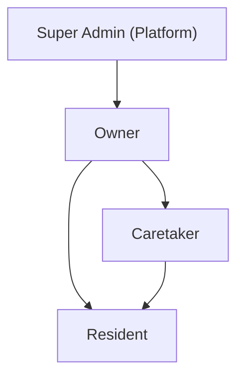

| Role | Description | Access Level |
|---|---|---|
| **Super Admin** | Platform operator (PG OS team) | Full system access, tenant management |
| **Owner** | PG business owner | All properties they own; full CRUD on property data; financial reports; user management for caretakers |
| **Caretaker** | On-site operational manager | Assigned properties only; operational actions (allocation, complaints, rent verification); no financial configuration |
| **Resident** | Occupant of a PG bed | Own profile, rent, receipts, complaints, notices; read-only on property info |

### 3.2 Permission Matrix

| Capability | Super Admin | Owner | Caretaker | Resident |
|---|---|---|---|---|
| Create Property | ✅ | ✅ | ❌ | ❌ |
| Edit Property Config | ✅ | ✅ | ❌ | ❌ |
| View All Properties | ✅ | Own only | Assigned only | ❌ |
| Add Caretaker | ✅ | ✅ | ❌ | ❌ |
| Onboard Resident | ✅ | ✅ | ✅ | ❌ |
| Allocate Room/Bed | ✅ | ✅ | ✅ | ❌ |
| View Revenue/Financial Data | ✅ | ✅ | ❌ | Own rent only |
| Mark Rent as Paid | ✅ | ✅ | ✅ | ❌ |
| Raise Complaint | ✅ | ✅ | ✅ | ✅ |
| Resolve Complaint | ✅ | ✅ | ✅ | ❌ |
| Confirm Complaint Resolution | ❌ | ❌ | ❌ | ✅ |
| Approve Move-Out | ✅ | ✅ | ✅ | ❌ |
| Request Move-Out | ❌ | ❌ | ❌ | ✅ |
| View Analytics | ✅ | ✅ | Limited | ❌ |
| Send Announcements | ✅ | ✅ | ✅ | ❌ |
| Manage Food Menu | ✅ | ✅ | ✅ | ❌ |
| View Visitor Logs | ✅ | ✅ | ✅ | Own only |

---

## 4. System Architecture Overview

### 4.1 High-Level Architecture

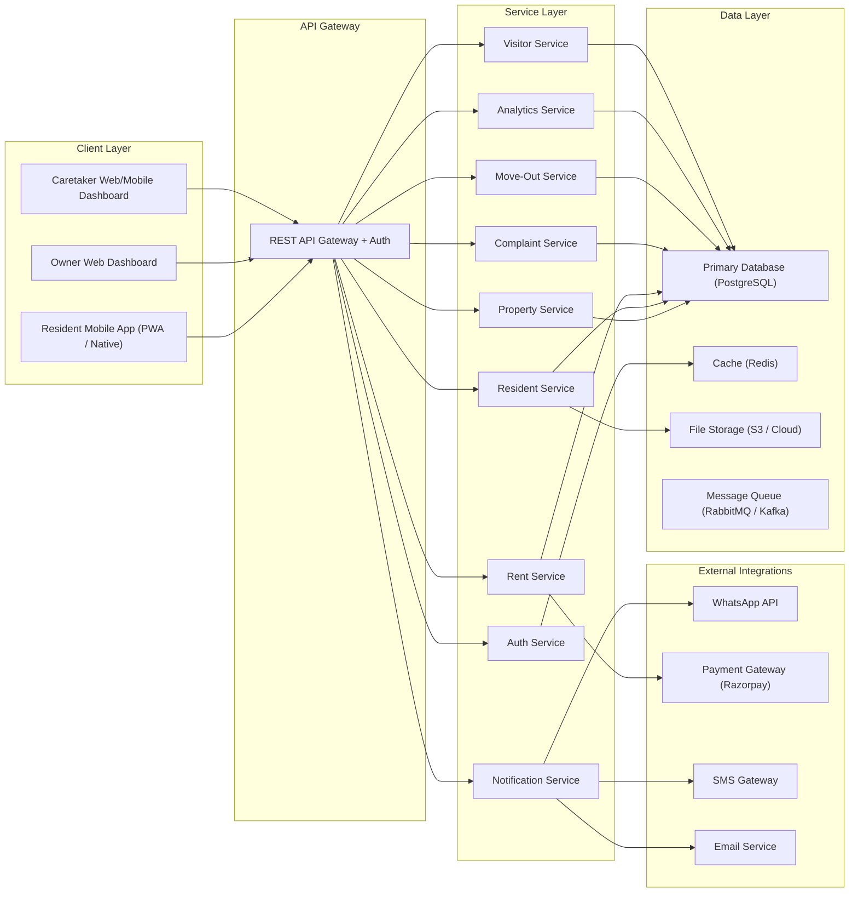

### 4.2 Multi-Tenancy Model

PG OS follows a **single-database, shared-schema** multi-tenancy model. All data is partitioned by `owner_id` at the application layer. Row-level security (RLS) policies enforce data isolation.

---

## 5. Module 1 — Authentication & User Management

### 5.1 Overview

Handles user registration, authentication, session management, and role-based access control for all personas.

### 5.2 Functional Requirements

| ID | Requirement | Priority | User Role |
|---|---|---|---|
| **AUTH-001** | System shall support mobile OTP-based login for all users | P0 | All |
| **AUTH-002** | System shall support email + password login as an alternative | P1 | Owner, Caretaker |
| **AUTH-003** | Owner shall be able to invite caretakers via phone number | P0 | Owner |
| **AUTH-004** | Caretaker shall be able to onboard residents and create their accounts | P0 | Caretaker |
| **AUTH-005** | System shall issue JWT tokens with role-based claims | P0 | System |
| **AUTH-006** | System shall support refresh token rotation for session persistence | P1 | System |
| **AUTH-007** | System shall enforce password complexity rules (min 8 chars, 1 uppercase, 1 number, 1 special) | P1 | Owner, Caretaker |
| **AUTH-008** | System shall lock accounts after 5 consecutive failed login attempts for 30 minutes | P1 | System |
| **AUTH-009** | Owner shall be able to deactivate caretaker accounts | P0 | Owner |
| **AUTH-010** | System shall maintain an audit log of all authentication events | P1 | System |
| **AUTH-011** | Resident account creation shall require phone number verification via OTP | P0 | System |
| **AUTH-012** | System shall support "Forgot Password" flow via OTP/email link | P1 | Owner, Caretaker |

### 5.3 User Stories

> **US-AUTH-01**: As an **Owner**, I want to log in using my phone number and OTP so that I don't need to remember a password.  
> **Acceptance Criteria**:
> - Owner enters a valid 10-digit Indian mobile number
> - System sends a 6-digit OTP via SMS within 30 seconds
> - OTP is valid for 5 minutes
> - After 3 invalid OTP attempts, a new OTP must be requested
> - On successful verification, user is redirected to the Owner Dashboard

> **US-AUTH-02**: As an **Owner**, I want to invite a caretaker by entering their phone number so that they can start managing my property.  
> **Acceptance Criteria**:
> - Owner selects a property and enters the caretaker's phone number
> - System sends an SMS invite with a link to download the app / set up account
> - Caretaker is auto-associated with the selected property upon registration
> - Owner can see pending and active caretaker invites

> **US-AUTH-03**: As a **Resident**, I want to log in using my phone number and OTP so that I can access my PG information on my phone.  
> **Acceptance Criteria**:
> - Resident enters registered phone number
> - OTP is sent and verified
> - Resident sees their profile, rent status, and active complaints on login

### 5.4 Data Model

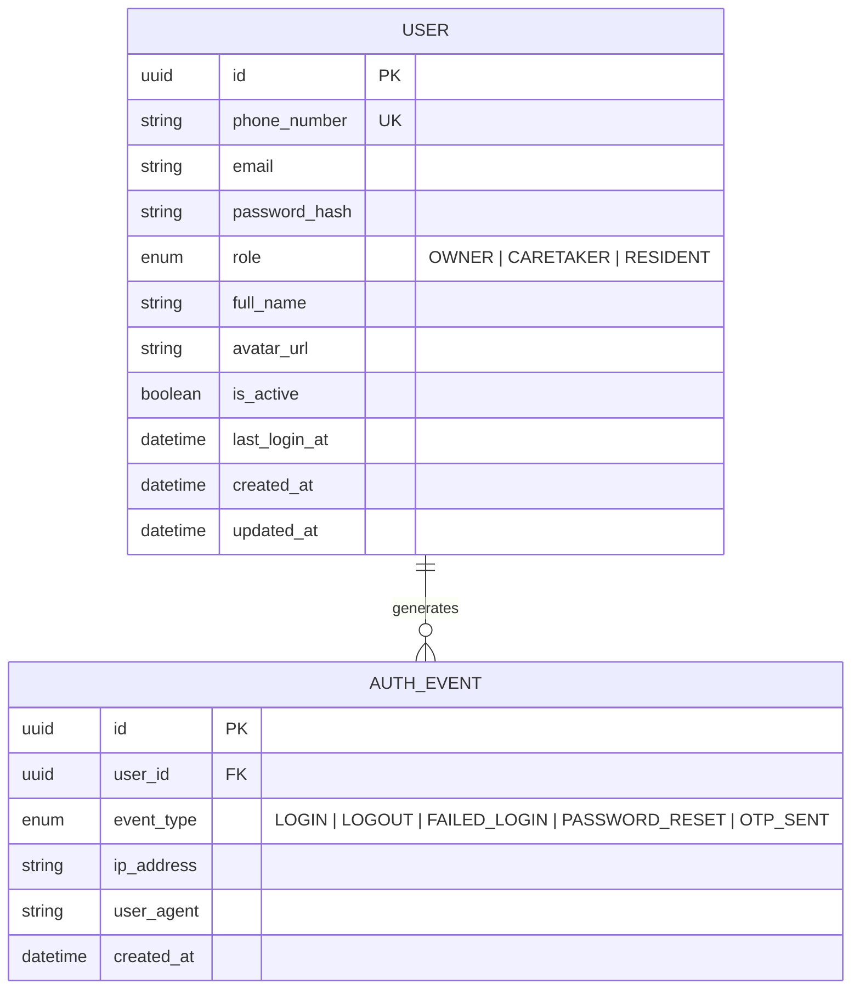

### 5.5 API Endpoints

| Method | Endpoint | Description | Auth Required |
|---|---|---|---|
| `POST` | `/api/v1/auth/otp/send` | Send OTP to phone number | No |
| `POST` | `/api/v1/auth/otp/verify` | Verify OTP and return tokens | No |
| `POST` | `/api/v1/auth/login` | Email + password login | No |
| `POST` | `/api/v1/auth/refresh` | Refresh access token | Refresh Token |
| `POST` | `/api/v1/auth/logout` | Invalidate session | Yes |
| `POST` | `/api/v1/auth/password/reset` | Initiate password reset | No |
| `POST` | `/api/v1/auth/invite/caretaker` | Invite caretaker | Owner |
| `GET` | `/api/v1/auth/invites` | List pending invites | Owner |

---

## 6. Module 2 — Property Management

### 6.1 Overview

Manages the hierarchical structure of properties: **Property → Floor → Room → Bed**. Supports multi-property management for owners who operate more than one PG.

### 6.2 Functional Requirements

| ID | Requirement | Priority | User Role |
|---|---|---|---|
| **PROP-001** | Owner shall be able to create a new property with name, address, type (Male/Female/Co-ed), and amenities | P0 | Owner |
| **PROP-002** | Owner shall be able to define floors within a property | P0 | Owner |
| **PROP-003** | Owner shall be able to define rooms within a floor with room number, type (Single/Double/Triple/Dormitory), and base rent | P0 | Owner |
| **PROP-004** | Owner shall be able to define beds within a room with bed identifier and individual rent (if different from room base rent) | P0 | Owner |
| **PROP-005** | System shall calculate and display real-time occupancy at property, floor, and room levels | P0 | Owner, Caretaker |
| **PROP-006** | Owner shall be able to edit property details (name, address, amenities, rules) at any time | P1 | Owner |
| **PROP-007** | Owner shall be able to set property-level configurations: notice period (days), security deposit amount, late payment penalty, grace period | P0 | Owner |
| **PROP-008** | System shall support uploading property images (max 10, max 5 MB each) | P2 | Owner |
| **PROP-009** | Caretaker shall be able to view the complete room map with occupancy status | P0 | Caretaker |
| **PROP-010** | System shall display vacancy count per property on the dashboard | P0 | Owner, Caretaker |
| **PROP-011** | Owner shall be able to soft-delete a property (archive). Active residents must be zero before archiving | P1 | Owner |
| **PROP-012** | System shall support property-level amenity tags (WiFi, AC, Laundry, Parking, Meals, Gym, etc.) | P1 | Owner |
| **PROP-013** | Owner shall be able to set room/bed-level rent variations (e.g., AC room premium) | P1 | Owner |
| **PROP-014** | System shall display a visual floor plan / grid view of rooms and beds with color-coded occupancy status (Occupied, Vacant, Under Maintenance, Reserved) | P1 | Owner, Caretaker |

### 6.3 User Stories

> **US-PROP-01**: As an **Owner**, I want to add a new PG property with its complete structure (floors, rooms, beds) so that the system can track occupancy and allocations.  
> **Acceptance Criteria**:
> - Owner can enter property name, full address (with pin code), property type
> - Owner can add 1+ floors, each with 1+ rooms, each with 1+ beds
> - System validates that room numbers are unique within a floor
> - System validates that bed identifiers are unique within a room
> - After creation, the property appears in the owner's property list with 0% occupancy

> **US-PROP-02**: As a **Caretaker**, I want to see a visual room map showing which beds are occupied, vacant, or under maintenance so that I can quickly allocate rooms to new residents.  
> **Acceptance Criteria**:
> - Room map shows a grid/list grouped by floor
> - Each bed shows: bed ID, resident name (if occupied), occupancy status with color coding
> - Color coding: Green = Vacant, Red = Occupied, Yellow = Reserved, Grey = Maintenance
> - Clicking a vacant bed opens the allocation flow

### 6.4 Data Model

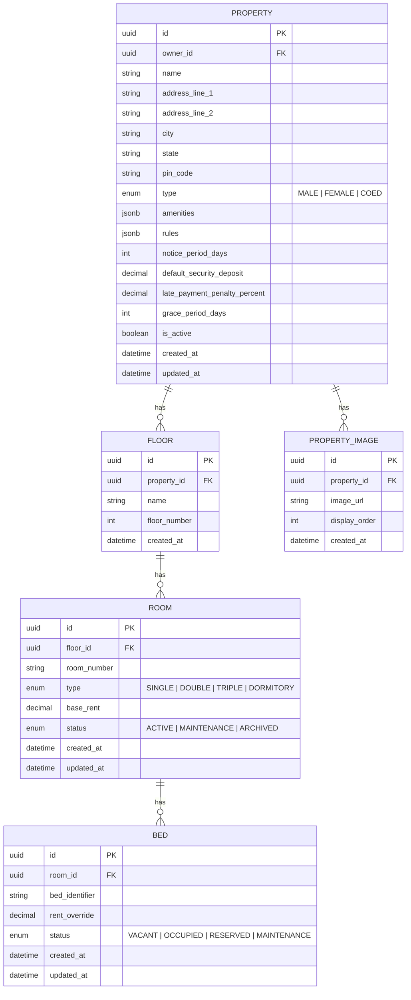

### 6.5 API Endpoints

| Method | Endpoint | Description | Auth Required |
|---|---|---|---|
| `POST` | `/api/v1/properties` | Create property | Owner |
| `GET` | `/api/v1/properties` | List owner's properties | Owner, Caretaker |
| `GET` | `/api/v1/properties/{id}` | Get property details | Owner, Caretaker |
| `PUT` | `/api/v1/properties/{id}` | Update property | Owner |
| `DELETE` | `/api/v1/properties/{id}` | Archive property | Owner |
| `POST` | `/api/v1/properties/{id}/floors` | Add floor | Owner |
| `POST` | `/api/v1/floors/{id}/rooms` | Add room | Owner |
| `POST` | `/api/v1/rooms/{id}/beds` | Add bed | Owner |
| `GET` | `/api/v1/properties/{id}/room-map` | Get visual room map data | Owner, Caretaker |
| `GET` | `/api/v1/properties/{id}/occupancy` | Get occupancy statistics | Owner, Caretaker |
| `PATCH` | `/api/v1/beds/{id}/status` | Update bed status | Owner, Caretaker |

---

## 7. Module 3 — Resident Onboarding & KYC

### 7.1 Overview

Manages the complete resident lifecycle from lead capture through onboarding, KYC verification, and agreement signing.

### 7.2 Functional Requirements

| ID | Requirement | Priority | User Role |
|---|---|---|---|
| **RES-001** | Caretaker/Owner shall be able to create a lead with name, phone, email, preferred room type, expected move-in date, and source | P0 | Owner, Caretaker |
| **RES-002** | System shall maintain lead status: New → Contacted → Visit Scheduled → Visited → Converted → Lost | P1 | Owner, Caretaker |
| **RES-003** | Caretaker shall be able to convert a lead to a resident by completing the onboarding form | P0 | Caretaker |
| **RES-004** | Onboarding form shall capture: full name, phone, email, emergency contact (name, phone, relation), permanent address, occupation, company/college name, move-in date | P0 | Caretaker |
| **RES-005** | System shall support KYC document upload: Aadhaar Card (front & back), PAN Card (optional), passport-size photo | P0 | Caretaker, Resident |
| **RES-006** | System shall validate Aadhaar format (12-digit numeric) | P1 | System |
| **RES-007** | System shall generate a digital rental agreement with auto-populated fields (resident details, room, rent, deposit, notice period, move-in date) | P1 | System |
| **RES-008** | Resident shall digitally accept the agreement via OTP-based e-signature | P1 | Resident |
| **RES-009** | System shall record security deposit payment at the time of onboarding | P0 | Caretaker |
| **RES-010** | System shall auto-create a resident user account and send login credentials via SMS | P0 | System |
| **RES-011** | Caretaker shall be able to search and filter residents by name, room, phone number, status | P0 | Caretaker |
| **RES-012** | System shall maintain a complete resident profile with personal info, KYC docs, agreement, payment history, complaints, and activity log | P0 | System |
| **RES-013** | Owner shall be able to view all residents across all properties with filters | P0 | Owner |
| **RES-014** | System shall track resident status: Active, On Notice, Moved Out, Blacklisted | P0 | System |

### 7.3 User Stories

> **US-RES-01**: As a **Caretaker**, I want to onboard a new resident by filling in their details, uploading KYC documents, recording the deposit, and allocating a bed — all in one flow — so that the process is fast and complete.  
> **Acceptance Criteria**:
> - Caretaker fills the onboarding form (mandatory fields validated)
> - Uploads Aadhaar front/back images (JPEG/PNG, max 2 MB each)
> - Selects an available bed from the room map
> - Records security deposit amount and payment mode (Cash / UPI / Bank Transfer)
> - On submission: resident account is created, bed status changes to Occupied, SMS with login details is sent to resident, agreement PDF is generated

> **US-RES-02**: As a **Resident**, I want to view and download my KYC documents and rental agreement from the app so that I have digital access to my records.  
> **Acceptance Criteria**:
> - Resident can view uploaded Aadhaar and photo in their profile
> - Resident can download the signed rental agreement as a PDF
> - Documents are accessible even after move-out for 1 year

### 7.4 Data Model

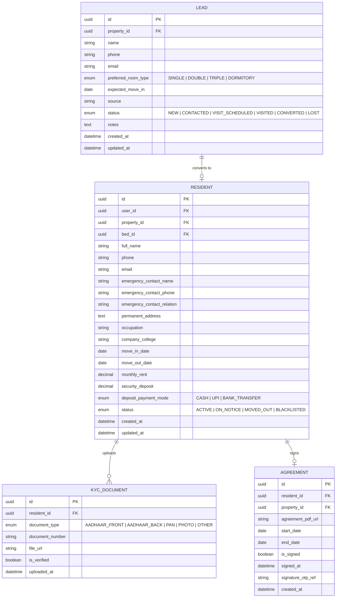

### 7.5 API Endpoints

| Method | Endpoint | Description | Auth Required |
|---|---|---|---|
| `POST` | `/api/v1/leads` | Create a new lead | Owner, Caretaker |
| `GET` | `/api/v1/leads` | List leads with filters | Owner, Caretaker |
| `PATCH` | `/api/v1/leads/{id}/status` | Update lead status | Owner, Caretaker |
| `POST` | `/api/v1/residents` | Onboard a new resident | Owner, Caretaker |
| `GET` | `/api/v1/residents` | List residents with filters | Owner, Caretaker |
| `GET` | `/api/v1/residents/{id}` | Get resident full profile | Owner, Caretaker, Resident (own) |
| `PUT` | `/api/v1/residents/{id}` | Update resident details | Owner, Caretaker |
| `POST` | `/api/v1/residents/{id}/kyc` | Upload KYC document | Owner, Caretaker, Resident |
| `GET` | `/api/v1/residents/{id}/kyc` | Get KYC documents | Owner, Caretaker, Resident (own) |
| `POST` | `/api/v1/residents/{id}/agreement` | Generate agreement | System |
| `POST` | `/api/v1/residents/{id}/agreement/sign` | Sign agreement via OTP | Resident |
| `GET` | `/api/v1/residents/{id}/agreement` | Download agreement PDF | Owner, Caretaker, Resident (own) |

---

## 8. Module 4 — Room Allocation & Shifting

### 8.1 Overview

Manages bed allocation during onboarding and room/bed shifting requests during a resident's stay.

### 8.2 Functional Requirements

| ID | Requirement | Priority | User Role |
|---|---|---|---|
| **ALLOC-001** | Caretaker shall be able to allocate a vacant bed to a resident during onboarding | P0 | Caretaker |
| **ALLOC-002** | System shall prevent double-allocation of the same bed | P0 | System |
| **ALLOC-003** | Caretaker shall be able to initiate a room/bed shift for a resident | P1 | Caretaker |
| **ALLOC-004** | Room shift shall require: target bed selection, reason, effective date | P1 | Caretaker |
| **ALLOC-005** | System shall auto-update rent if the new bed has a different rent amount | P1 | System |
| **ALLOC-006** | System shall maintain a complete allocation history for each resident | P1 | System |
| **ALLOC-007** | System shall update bed statuses atomically during shifting (old bed → Vacant, new bed → Occupied) | P0 | System |
| **ALLOC-008** | Resident shall be able to request a room shift (requires caretaker/owner approval) | P2 | Resident |
| **ALLOC-009** | System shall notify the resident via app notification and SMS when a room shift is executed | P1 | System |

### 8.3 User Stories

> **US-ALLOC-01**: As a **Caretaker**, I want to shift a resident from one bed to another so that I can accommodate room changes efficiently.  
> **Acceptance Criteria**:
> - Caretaker selects the resident and the target (vacant) bed
> - System shows rent difference (if any) and asks for confirmation
> - On confirmation: old bed → Vacant, new bed → Occupied, resident's rent is updated, allocation history is recorded, resident is notified

### 8.4 Data Model

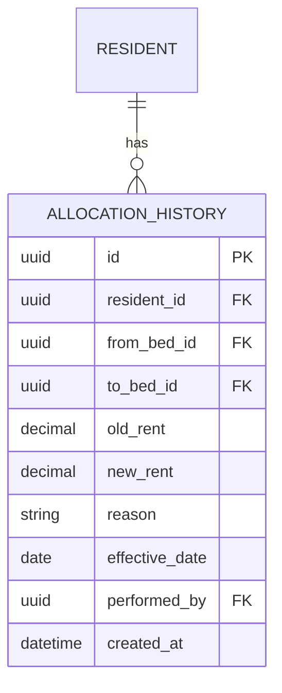

### 8.5 API Endpoints

| Method | Endpoint | Description | Auth Required |
|---|---|---|---|
| `POST` | `/api/v1/allocations/shift` | Initiate room/bed shift | Owner, Caretaker |
| `GET` | `/api/v1/residents/{id}/allocation-history` | View allocation history | Owner, Caretaker, Resident (own) |
| `POST` | `/api/v1/allocations/shift-request` | Resident requests a shift | Resident |
| `PATCH` | `/api/v1/allocations/shift-request/{id}` | Approve/reject shift request | Owner, Caretaker |

---

## 9. Module 5 — Rent Module

### 9.1 Overview

Automates monthly rent generation, payment tracking, receipt generation, overdue management, and reminders. This is the financial backbone of PG OS.

### 9.2 Functional Requirements

| ID | Requirement | Priority | User Role |
|---|---|---|---|
| **RENT-001** | System shall auto-generate monthly rent entries for all active residents on the 1st of each month (configurable per property) | P0 | System |
| **RENT-002** | Each rent entry shall include: resident, month/year, base rent, adjustments (electricity, meals, etc.), total amount, due date, status | P0 | System |
| **RENT-003** | Caretaker shall be able to manually record a rent payment with: amount, payment mode (Cash/UPI/Bank Transfer/Cheque), transaction reference, payment date | P0 | Caretaker |
| **RENT-004** | System shall auto-generate a digital receipt (PDF) upon payment recording | P0 | System |
| **RENT-005** | Resident shall be able to view and download rent receipts from the app | P0 | Resident |
| **RENT-006** | System shall track rent statuses: Generated → Partially Paid → Paid → Overdue | P0 | System |
| **RENT-007** | System shall mark rent as Overdue if not paid by due date + grace period | P0 | System |
| **RENT-008** | System shall calculate and apply late payment penalty (configurable % per property) after grace period | P1 | System |
| **RENT-009** | System shall send automated rent reminders: 3 days before due, on due date, 1 day after due, 7 days overdue, 15 days overdue | P0 | System |
| **RENT-010** | Owner shall be able to view consolidated rent collection status across all properties | P0 | Owner |
| **RENT-011** | Owner shall be able to apply one-time adjustments (discounts, additional charges) to a resident's rent | P1 | Owner |
| **RENT-012** | System shall support partial payments and track the remaining balance | P1 | System |
| **RENT-013** | System shall maintain a complete payment history per resident | P0 | System |
| **RENT-014** | Caretaker shall be able to view a monthly rent collection summary per property | P0 | Caretaker |
| **RENT-015** | System shall support pro-rated rent for mid-month move-ins and move-outs | P1 | System |
| **RENT-016** | System shall generate month-end rent collection reports exportable as CSV/PDF | P1 | Owner |

### 9.3 User Stories

> **US-RENT-01**: As a **Caretaker**, I want to see a list of all pending rents for the current month so that I can follow up with residents who haven't paid.  
> **Acceptance Criteria**:
> - Caretaker sees a list of residents with unpaid/partially-paid rent for the current month
> - List shows: resident name, room/bed, total amount, amount paid, balance, due date, overdue status
> - List is sortable by amount, due date, and overdue days
> - Caretaker can click a resident to record a payment

> **US-RENT-02**: As a **Resident**, I want to see my rent for the current month, payment history, and download receipts so that I have a clear record.  
> **Acceptance Criteria**:
> - Resident sees current month's rent: amount, due date, status, any penalties
> - Resident sees a chronological list of all past payments
> - Each paid entry has a "Download Receipt" button that generates a PDF
> - Receipt includes: PG name, resident name, room, month, amount, payment mode, date, transaction ref

> **US-RENT-03**: As an **Owner**, I want to see a dashboard showing total rent collected, pending, and overdue across all my properties for the current month so that I have full financial visibility.  
> **Acceptance Criteria**:
> - Dashboard shows: total expected rent, total collected, total pending, total overdue
> - Breakdown by property is available
> - Clicking a property drills down to individual resident rent status

### 9.4 Data Model

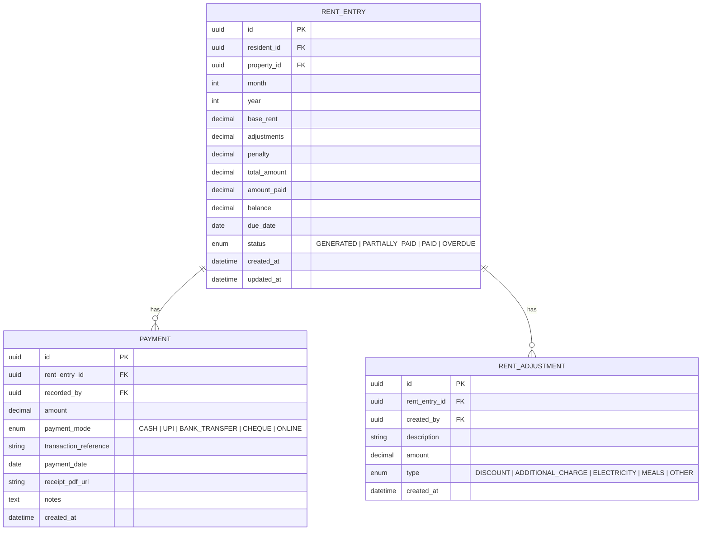

### 9.5 API Endpoints

| Method | Endpoint | Description | Auth Required |
|---|---|---|---|
| `GET` | `/api/v1/rent/entries` | List rent entries with filters (month, year, status, property, resident) | Owner, Caretaker |
| `GET` | `/api/v1/rent/entries/{id}` | Get rent entry details | Owner, Caretaker, Resident (own) |
| `POST` | `/api/v1/rent/entries/{id}/payments` | Record a payment | Owner, Caretaker |
| `GET` | `/api/v1/rent/entries/{id}/receipt` | Download payment receipt PDF | Owner, Caretaker, Resident (own) |
| `POST` | `/api/v1/rent/entries/{id}/adjustments` | Add adjustment | Owner |
| `GET` | `/api/v1/rent/summary` | Monthly rent summary across properties | Owner |
| `GET` | `/api/v1/rent/summary/{propertyId}` | Property-level rent summary | Owner, Caretaker |
| `GET` | `/api/v1/residents/{id}/payment-history` | Resident's complete payment history | Owner, Caretaker, Resident (own) |
| `GET` | `/api/v1/rent/reports/export` | Export rent report (CSV/PDF) | Owner |

### 9.6 Business Rules

| Rule ID | Rule | Trigger |
|---|---|---|
| BR-RENT-01 | Rent entries are auto-generated on the 1st of each month at 00:01 IST via a scheduled job | Cron job |
| BR-RENT-02 | Grace period is property-configurable (default: 5 days). After grace period, status changes to OVERDUE | Daily check job |
| BR-RENT-03 | Late penalty = `total_amount × late_payment_penalty_percent / 100` applied once after grace period | Daily check job |
| BR-RENT-04 | Pro-rated rent for mid-month move-in = `(monthly_rent / days_in_month) × remaining_days` | Onboarding event |
| BR-RENT-05 | Pro-rated rent for mid-month move-out = `(monthly_rent / days_in_month) × days_stayed` | Move-out event |

---

## 10. Module 6 — Complaint Management

### 10.1 Overview

A complete complaint lifecycle from raising to resolution with image attachments, tracking, and resident confirmation.

### 10.2 Functional Requirements

| ID | Requirement | Priority | User Role |
|---|---|---|---|
| **COMP-001** | Resident shall be able to raise a complaint with: category, description, and up to 3 images | P0 | Resident |
| **COMP-002** | System shall support complaint categories: Plumbing, Electrical, Furniture, Cleanliness, Food Quality, WiFi/Internet, Noise, Safety, Room Maintenance, Other | P0 | System |
| **COMP-003** | System shall auto-assign a unique complaint ticket number (e.g., `COMP-2026-0001`) | P0 | System |
| **COMP-004** | Complaint statuses: Open → In Progress → Resolved → Confirmed → Reopened → Closed | P0 | System |
| **COMP-005** | Caretaker shall be able to update complaint status and add internal notes | P0 | Caretaker |
| **COMP-006** | When a complaint is marked as Resolved, the resident shall receive a notification to confirm resolution | P0 | System |
| **COMP-007** | Resident shall be able to confirm resolution (→ Closed) or reject and reopen with a comment | P0 | Resident |
| **COMP-008** | If the resident does not confirm within 48 hours, system shall auto-close the complaint | P1 | System |
| **COMP-009** | Owner shall be able to view all complaints across properties with filters (status, category, property, date range) | P0 | Owner |
| **COMP-010** | System shall track complaint SLA: time to first response, time to resolution | P1 | System |
| **COMP-011** | System shall escalate complaints that have been Open for > 48 hours to the Owner | P1 | System |
| **COMP-012** | Caretaker dashboard shall show count of open and overdue complaints | P0 | Caretaker |

### 10.3 User Stories

> **US-COMP-01**: As a **Resident**, I want to raise a complaint about a maintenance issue with photos so that the caretaker can address it quickly.  
> **Acceptance Criteria**:
> - Resident selects a category from the predefined list
> - Enters a description (min 10 characters, max 1000 characters)
> - Optionally attaches up to 3 images (JPEG/PNG, max 3 MB each)
> - On submission: ticket number is generated and displayed, caretaker is notified, complaint appears in resident's complaint list

> **US-COMP-02**: As a **Resident**, I want to confirm or reopen a resolved complaint so that issues are truly fixed before being closed.  
> **Acceptance Criteria**:
> - Resident receives a push notification + in-app banner when a complaint is marked Resolved
> - Resident can tap "Confirm Fixed" (→ status = Closed) or "Reopen" with a comment (→ status = Reopened)
> - If reopened, caretaker is notified immediately

### 10.4 Data Model

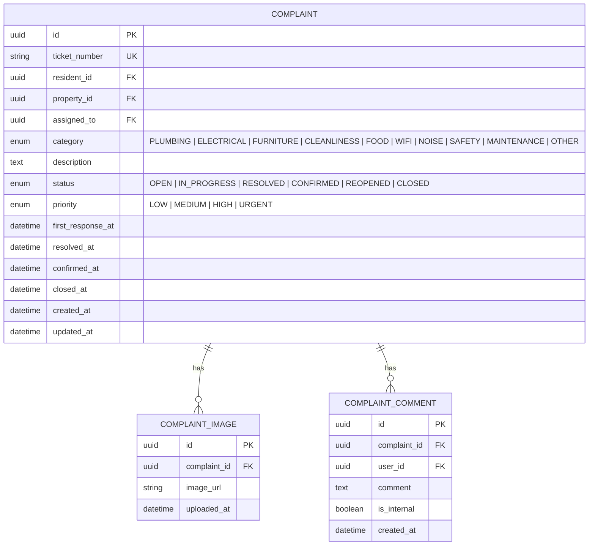

### 10.5 API Endpoints

| Method | Endpoint | Description | Auth Required |
|---|---|---|---|
| `POST` | `/api/v1/complaints` | Raise a complaint | Resident |
| `GET` | `/api/v1/complaints` | List complaints with filters | Owner, Caretaker, Resident (own) |
| `GET` | `/api/v1/complaints/{id}` | Get complaint details | Owner, Caretaker, Resident (own) |
| `PATCH` | `/api/v1/complaints/{id}/status` | Update complaint status | Owner, Caretaker |
| `POST` | `/api/v1/complaints/{id}/comments` | Add comment/note | Owner, Caretaker, Resident (own) |
| `POST` | `/api/v1/complaints/{id}/confirm` | Resident confirms resolution | Resident |
| `POST` | `/api/v1/complaints/{id}/reopen` | Resident reopens complaint | Resident |
| `GET` | `/api/v1/complaints/summary` | Complaint analytics | Owner |

---

## 11. Module 7 — Move-Out & Deposit Settlement

### 11.1 Overview

Manages the complete move-out workflow: notice submission, inspection, deposit deductions, settlement, and vacancy generation.

### 11.2 Functional Requirements

| ID | Requirement | Priority | User Role |
|---|---|---|---|
| **MO-001** | Resident shall be able to submit a move-out request with: expected move-out date and reason | P0 | Resident |
| **MO-002** | System shall validate that the requested move-out date respects the notice period configured for the property | P0 | System |
| **MO-003** | If the move-out date is within the notice period, system shall display a warning about potential notice period charges | P1 | System |
| **MO-004** | Caretaker shall be able to approve or reject a move-out request | P0 | Caretaker |
| **MO-005** | On approval, resident status shall change to "On Notice" | P0 | System |
| **MO-006** | Caretaker shall conduct a room inspection and record: inspection date, condition notes, damage items with costs | P1 | Caretaker |
| **MO-007** | System shall calculate deposit settlement: security deposit − pending rent − damage charges − notice period shortfall = refund amount | P0 | System |
| **MO-008** | Caretaker/Owner shall confirm the final settlement amount | P0 | Owner, Caretaker |
| **MO-009** | System shall generate a settlement statement PDF | P1 | System |
| **MO-010** | On move-out completion: resident status → Moved Out, bed status → Vacant, resident's active session is terminated | P0 | System |
| **MO-011** | System shall retain moved-out resident data for reporting and historical access | P0 | System |
| **MO-012** | Owner shall be able to view all move-out requests and settlement history | P0 | Owner |

### 11.3 User Stories

> **US-MO-01**: As a **Resident**, I want to submit a move-out request from the app so that the PG can prepare for my departure.  
> **Acceptance Criteria**:
> - Resident selects a move-out date from a date picker (minimum: today + 1)
> - System shows notice period requirement and any potential charges
> - Resident enters a reason (optional)
> - On submission: caretaker is notified, request appears in pending list

> **US-MO-02**: As a **Caretaker**, I want to process a move-out by conducting inspection, recording damages, and settling the deposit so that the financial closure is clean and transparent.  
> **Acceptance Criteria**:
> - Caretaker opens the approved move-out request
> - Records inspection: date, condition (Good/Fair/Poor), damage items (description + cost)
> - System auto-calculates: deposit − pending rent − damages − notice shortfall = refund
> - Caretaker confirms the settlement
> - System generates settlement PDF, updates bed to Vacant, updates resident status to Moved Out

### 11.4 Data Model

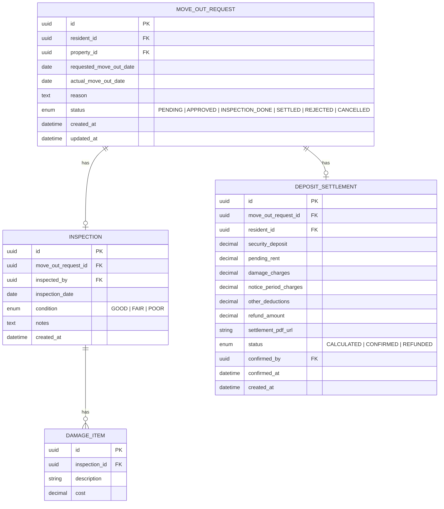

### 11.5 API Endpoints

| Method | Endpoint | Description | Auth Required |
|---|---|---|---|
| `POST` | `/api/v1/move-out/requests` | Submit move-out request | Resident |
| `GET` | `/api/v1/move-out/requests` | List move-out requests | Owner, Caretaker |
| `PATCH` | `/api/v1/move-out/requests/{id}/approve` | Approve move-out request | Owner, Caretaker |
| `PATCH` | `/api/v1/move-out/requests/{id}/reject` | Reject move-out request | Owner, Caretaker |
| `POST` | `/api/v1/move-out/requests/{id}/inspection` | Record inspection | Caretaker |
| `GET` | `/api/v1/move-out/requests/{id}/settlement` | Get settlement calculation | Owner, Caretaker, Resident (own) |
| `POST` | `/api/v1/move-out/requests/{id}/settlement/confirm` | Confirm settlement | Owner, Caretaker |
| `GET` | `/api/v1/move-out/requests/{id}/settlement/pdf` | Download settlement PDF | Owner, Caretaker, Resident (own) |

---

## 12. Module 8 — Communication & Notifications

### 12.1 Overview

Centralised communication layer for announcements, reminders, menu updates, emergency notices, and multi-channel notifications (in-app, push, SMS, WhatsApp, email).

### 12.2 Functional Requirements

| ID | Requirement | Priority | User Role |
|---|---|---|---|
| **COMM-001** | Caretaker/Owner shall be able to create announcements targeted to: all residents of a property, a specific floor, or a specific room | P0 | Owner, Caretaker |
| **COMM-002** | Announcement shall support: title, body text, optional image, priority (Normal/Urgent), and expiry date | P0 | Owner, Caretaker |
| **COMM-003** | Urgent announcements shall trigger push notifications immediately | P0 | System |
| **COMM-004** | Caretaker shall be able to update the daily/weekly food menu | P1 | Caretaker |
| **COMM-005** | Resident shall be able to view the current food menu from the app | P1 | Resident |
| **COMM-006** | System shall send automated rent reminders via WhatsApp and/or SMS at configurable intervals | P0 | System |
| **COMM-007** | System shall send WhatsApp notifications for: new complaint update, move-out approval, important announcements | P1 | System |
| **COMM-008** | Owner shall be able to send a direct message to a specific resident | P2 | Owner |
| **COMM-009** | System shall maintain a notification log per user with read/unread status | P1 | System |
| **COMM-010** | Owner shall be able to configure notification preferences per property (enable/disable WhatsApp, SMS, email) | P1 | Owner |
| **COMM-011** | System shall support emergency broadcast that sends immediate WhatsApp + SMS + push to all property residents | P0 | Owner, Caretaker |

### 12.3 User Stories

> **US-COMM-01**: As a **Caretaker**, I want to post a daily food menu so that residents know what meals are available.  
> **Acceptance Criteria**:
> - Caretaker selects date and meal type (Breakfast / Lunch / Dinner)
> - Enters menu items as a list
> - On save: menu is visible to all residents in the app under "Today's Menu"
> - Optionally sends a push notification to residents

> **US-COMM-02**: As an **Owner**, I want to send an emergency notice (e.g., water shutdown, fire drill) to all residents via all channels immediately.  
> **Acceptance Criteria**:
> - Owner selects "Emergency Broadcast" and types the message
> - System sends: push notification + SMS + WhatsApp to all active residents of the property
> - Broadcast is logged with delivery status per channel per resident

### 12.4 Data Model

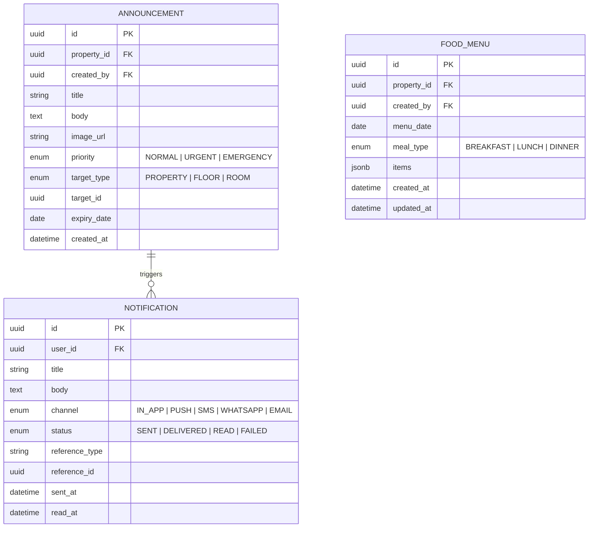

### 12.5 API Endpoints

| Method | Endpoint | Description | Auth Required |
|---|---|---|---|
| `POST` | `/api/v1/announcements` | Create announcement | Owner, Caretaker |
| `GET` | `/api/v1/announcements` | List announcements | All |
| `DELETE` | `/api/v1/announcements/{id}` | Delete announcement | Owner, Caretaker |
| `POST` | `/api/v1/food-menu` | Create/update food menu | Caretaker |
| `GET` | `/api/v1/food-menu` | Get food menu for date | All |
| `GET` | `/api/v1/notifications` | List user's notifications | All |
| `PATCH` | `/api/v1/notifications/{id}/read` | Mark notification as read | All |
| `POST` | `/api/v1/emergency-broadcast` | Send emergency broadcast | Owner, Caretaker |

---

## 13. Module 9 — Owner Dashboard

### 13.1 Overview

A comprehensive dashboard providing owners with real-time visibility into revenue, occupancy, complaints, vacancies, and analytics across all their properties.

### 13.2 Functional Requirements

| ID | Requirement | Priority | User Role |
|---|---|---|---|
| **OD-001** | Dashboard shall display a multi-property overview with key metrics per property | P0 | Owner |
| **OD-002** | Key metrics: total revenue (current month), occupancy %, pending rent amount, overdue rent amount, open complaints count, vacancies count | P0 | Owner |
| **OD-003** | Owner shall be able to drill down from multi-property view to a single property view | P0 | Owner |
| **OD-004** | Dashboard shall display a revenue trend chart (last 6 months) | P1 | Owner |
| **OD-005** | Dashboard shall display an occupancy trend chart (last 6 months) | P1 | Owner |
| **OD-006** | Dashboard shall show a list of overdue rent entries with days overdue and amount | P0 | Owner |
| **OD-007** | Dashboard shall show recent complaints (last 7 days) with status badges | P0 | Owner |
| **OD-008** | Dashboard shall show upcoming move-outs (next 30 days) | P1 | Owner |
| **OD-009** | Dashboard shall show new move-ins (last 30 days) | P1 | Owner |
| **OD-010** | Owner shall be able to filter all data by property and date range | P0 | Owner |
| **OD-011** | Owner shall be able to export reports (revenue, occupancy, rent collection) as CSV or PDF | P1 | Owner |
| **OD-012** | Dashboard shall show a comparative view of properties (table with sortable columns) | P2 | Owner |

### 13.3 Dashboard Widgets

| Widget | Data Displayed | Refresh Frequency |
|---|---|---|
| Revenue Card | Total collected this month vs. expected | Real-time |
| Occupancy Gauge | % occupied beds with visual gauge | Real-time |
| Pending Rent Alert | Count and sum of unpaid rents | Real-time |
| Overdue Table | Resident, room, amount, days overdue | Real-time |
| Vacancy Counter | Available beds per property | Real-time |
| Complaint Ticker | Open + In-Progress complaint count | Real-time |
| Revenue Chart | Line chart — last 6 months | Daily |
| Occupancy Chart | Area chart — last 6 months | Daily |
| Recent Activity Feed | Last 20 events across all properties | Real-time |

### 13.4 API Endpoints

| Method | Endpoint | Description | Auth Required |
|---|---|---|---|
| `GET` | `/api/v1/dashboard/owner/overview` | Multi-property overview | Owner |
| `GET` | `/api/v1/dashboard/owner/revenue` | Revenue data with trends | Owner |
| `GET` | `/api/v1/dashboard/owner/occupancy` | Occupancy data with trends | Owner |
| `GET` | `/api/v1/dashboard/owner/overdue` | Overdue rent list | Owner |
| `GET` | `/api/v1/dashboard/owner/complaints` | Recent complaints | Owner |
| `GET` | `/api/v1/dashboard/owner/move-outs` | Upcoming move-outs | Owner |
| `GET` | `/api/v1/dashboard/owner/activity-feed` | Recent activity feed | Owner |
| `GET` | `/api/v1/dashboard/owner/export` | Export reports | Owner |

---

## 14. Module 10 — Caretaker Dashboard

### 14.1 Overview

A simplified, action-oriented dashboard designed for day-to-day operational efficiency. Focuses on "what needs to be done today."

### 14.2 Functional Requirements

| ID | Requirement | Priority | User Role |
|---|---|---|---|
| **CD-001** | Dashboard shall display "Today's Tasks" — a prioritised list of actionable items | P0 | Caretaker |
| **CD-002** | Today's Tasks shall include: pending rent follow-ups, open complaints, scheduled move-ins, scheduled move-outs, pending inspection | P0 | Caretaker |
| **CD-003** | Dashboard shall display a quick room map with occupancy status | P0 | Caretaker |
| **CD-004** | Dashboard shall show rent collection progress for the current month (collected / total with progress bar) | P0 | Caretaker |
| **CD-005** | Dashboard shall show open complaint count with urgency indicators | P0 | Caretaker |
| **CD-006** | Dashboard shall provide quick-action buttons: Record Payment, Raise Complaint, Post Notice, Update Menu | P0 | Caretaker |
| **CD-007** | Dashboard shall display today's food menu at a glance | P1 | Caretaker |
| **CD-008** | Dashboard shall show recent notices/announcements | P1 | Caretaker |
| **CD-009** | Caretaker shall be able to mark tasks as done from the dashboard | P1 | Caretaker |

### 14.3 Today's Task Auto-Generation Rules

| Task Type | Generation Logic | Priority |
|---|---|---|
| Rent Follow-Up | Residents with rent status = GENERATED or OVERDUE after grace period | High |
| Open Complaint | Complaints with status = OPEN for > 24 hours | High |
| Scheduled Move-In | Residents with move_in_date = today and incomplete onboarding | Medium |
| Scheduled Move-Out | Move-out requests with actual_move_out_date = today | Medium |
| Pending Inspection | Approved move-out requests without inspection recorded | Medium |
| Menu Update | If no menu posted for today | Low |

### 14.4 API Endpoints

| Method | Endpoint | Description | Auth Required |
|---|---|---|---|
| `GET` | `/api/v1/dashboard/caretaker/tasks` | Today's tasks | Caretaker |
| `PATCH` | `/api/v1/dashboard/caretaker/tasks/{id}/done` | Mark task as done | Caretaker |
| `GET` | `/api/v1/dashboard/caretaker/rent-progress` | Rent collection progress | Caretaker |
| `GET` | `/api/v1/dashboard/caretaker/quick-stats` | Quick stats overview | Caretaker |

---

## 15. Module 11 — Resident App

### 15.1 Overview

A mobile-first (PWA or native) self-service application for residents to manage their PG experience.

### 15.2 Functional Requirements

| ID | Requirement | Priority | User Role |
|---|---|---|---|
| **RA-001** | Resident shall see a home screen with: current rent status, active complaints, recent notices, food menu, and quick actions | P0 | Resident |
| **RA-002** | Resident shall be able to view and edit their profile (limited fields: phone, email, emergency contact, profile photo) | P0 | Resident |
| **RA-003** | Resident shall be able to view their current room/bed details and room-mates | P1 | Resident |
| **RA-004** | Resident shall be able to view current month's rent and payment history | P0 | Resident |
| **RA-005** | Resident shall be able to download rent receipts as PDF | P0 | Resident |
| **RA-006** | Resident shall be able to raise, track, and confirm/reopen complaints | P0 | Resident |
| **RA-007** | Resident shall be able to view announcements and notices | P0 | Resident |
| **RA-008** | Resident shall be able to view the daily food menu | P1 | Resident |
| **RA-009** | Resident shall be able to submit a move-out request | P0 | Resident |
| **RA-010** | Resident shall be able to view and download their KYC documents and rental agreement | P1 | Resident |
| **RA-011** | Resident shall be able to submit a visitor request (name, purpose, expected date/time) | P2 | Resident |
| **RA-012** | Resident shall be able to request a room shift | P2 | Resident |
| **RA-013** | Resident shall receive push notifications for: rent reminders, complaint updates, announcements, move-out updates | P0 | Resident |
| **RA-014** | Resident shall be able to view the PG's house rules and amenities | P2 | Resident |

### 15.3 Resident Home Screen Layout

| Section | Content | Priority |
|---|---|---|
| Header | Profile photo, greeting, room number | P0 |
| Rent Card | Current month rent status, amount, due date, "Pay" CTA (if online payment enabled) | P0 |
| Quick Actions | Raise Complaint, View Menu, View Notices, Request Move-Out | P0 |
| Active Complaints | List of open/in-progress complaints with status badges | P0 |
| Announcements | Latest 3 notices/announcements | P0 |
| Food Menu | Today's menu at a glance | P1 |

---

## 16. Module 12 — Premium Features

### 16.1 Overview

Advanced features available as premium add-ons for higher-tier plans.

### 16.2 Functional Requirements

#### 16.2.1 Visitor Pass System

| ID | Requirement | Priority | User Role |
|---|---|---|---|
| **VIS-001** | Resident shall be able to create a visitor pass with: visitor name, phone, purpose, expected date/time | P2 | Resident |
| **VIS-002** | System shall generate a QR code or OTP for the visitor pass | P2 | System |
| **VIS-003** | Caretaker/Security shall be able to scan QR or verify OTP at entry | P2 | Caretaker |
| **VIS-004** | System shall log visitor check-in and check-out times | P2 | System |
| **VIS-005** | Owner shall be able to view visitor logs with filters (date, property, resident) | P2 | Owner |

#### 16.2.2 Staff Management

| ID | Requirement | Priority | User Role |
|---|---|---|---|
| **STAFF-001** | Owner shall be able to add staff members with: name, role (Cook, Cleaner, Security, Maintenance), phone, salary, assigned property | P2 | Owner |
| **STAFF-002** | System shall track staff attendance (check-in / check-out) | P2 | System |
| **STAFF-003** | Owner shall be able to view staff attendance reports | P2 | Owner |

#### 16.2.3 Security Logs

| ID | Requirement | Priority | User Role |
|---|---|---|---|
| **SEC-001** | System shall log all entry/exit events (residents and visitors) | P2 | System |
| **SEC-002** | Owner shall be able to view security logs with filters | P2 | Owner |
| **SEC-003** | System shall support integration with digital access control systems (API-based) | P3 | System |

### 16.3 Data Model — Visitor Pass

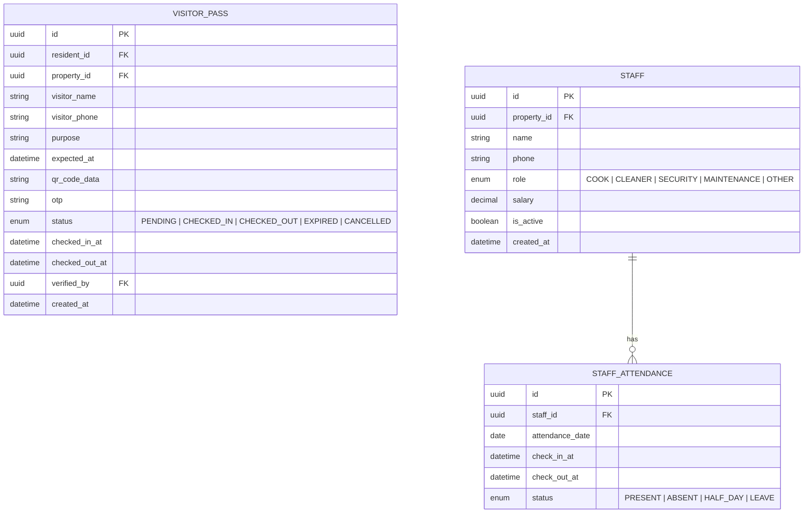

---

## 17. Non-Functional Requirements

### 17.1 Performance

| ID | Requirement | Target |
|---|---|---|
| NFR-PERF-001 | API response time for CRUD operations | < 200ms (p95) |
| NFR-PERF-002 | Dashboard page load time | < 2 seconds (p95) |
| NFR-PERF-003 | PDF generation (receipt / settlement) | < 5 seconds |
| NFR-PERF-004 | Concurrent users per tenant | Up to 500 |
| NFR-PERF-005 | Notification delivery (push / in-app) | < 5 seconds |
| NFR-PERF-006 | WhatsApp/SMS delivery | < 30 seconds (dependent on provider) |

### 17.2 Scalability

| ID | Requirement | Target |
|---|---|---|
| NFR-SCALE-001 | Horizontal scaling of API services | Auto-scaling based on CPU/memory |
| NFR-SCALE-002 | Database scaling | Read replicas for analytics queries |
| NFR-SCALE-003 | File storage | Cloud-based object storage (unlimited) |
| NFR-SCALE-004 | Multi-tenant capacity | 10,000+ tenants (owners) |

### 17.3 Security

| ID | Requirement | Target |
|---|---|---|
| NFR-SEC-001 | Data encryption in transit | TLS 1.3 |
| NFR-SEC-002 | Data encryption at rest | AES-256 for PII and KYC documents |
| NFR-SEC-003 | Authentication | JWT with RS256 signing |
| NFR-SEC-004 | API rate limiting | 100 requests/minute per user |
| NFR-SEC-005 | KYC document access | Signed URLs with 15-minute expiry |
| NFR-SEC-006 | Password hashing | bcrypt with cost factor 12 |
| NFR-SEC-007 | SQL injection protection | Parameterised queries / ORM |
| NFR-SEC-008 | XSS protection | Input sanitisation + CSP headers |
| NFR-SEC-009 | GDPR/Data privacy | Right to deletion for moved-out residents (after retention period) |
| NFR-SEC-010 | Audit logging | All write operations logged with user ID, timestamp, IP |

### 17.4 Availability & Reliability

| ID | Requirement | Target |
|---|---|---|
| NFR-AVAIL-001 | System uptime | 99.9% (excluding planned maintenance) |
| NFR-AVAIL-002 | Data backup | Daily automated backups, 30-day retention |
| NFR-AVAIL-003 | Disaster recovery | RPO: 1 hour, RTO: 4 hours |
| NFR-AVAIL-004 | Graceful degradation | Core features (rent, complaints) available even if analytics/notifications are down |

### 17.5 Usability

| ID | Requirement | Target |
|---|---|---|
| NFR-UX-001 | Mobile responsiveness | All screens usable on 320px–768px viewports |
| NFR-UX-002 | Language support | English and Hindi (Phase 1); extensible to regional languages |
| NFR-UX-003 | Accessibility | WCAG 2.1 Level AA compliance |
| NFR-UX-004 | Onboarding | Maximum 3 clicks to complete any primary action |
| NFR-UX-005 | Offline support (Resident App) | View last-synced rent status, menu, and notices offline |

---

## 18. End-to-End Workflows

### 18.1 Complete Resident Lifecycle

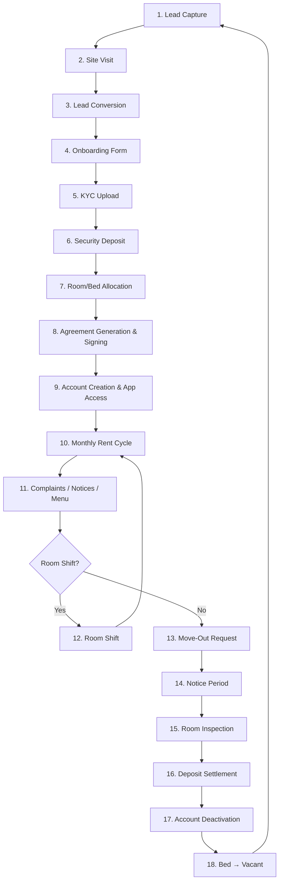

### 18.2 Rent Collection Workflow

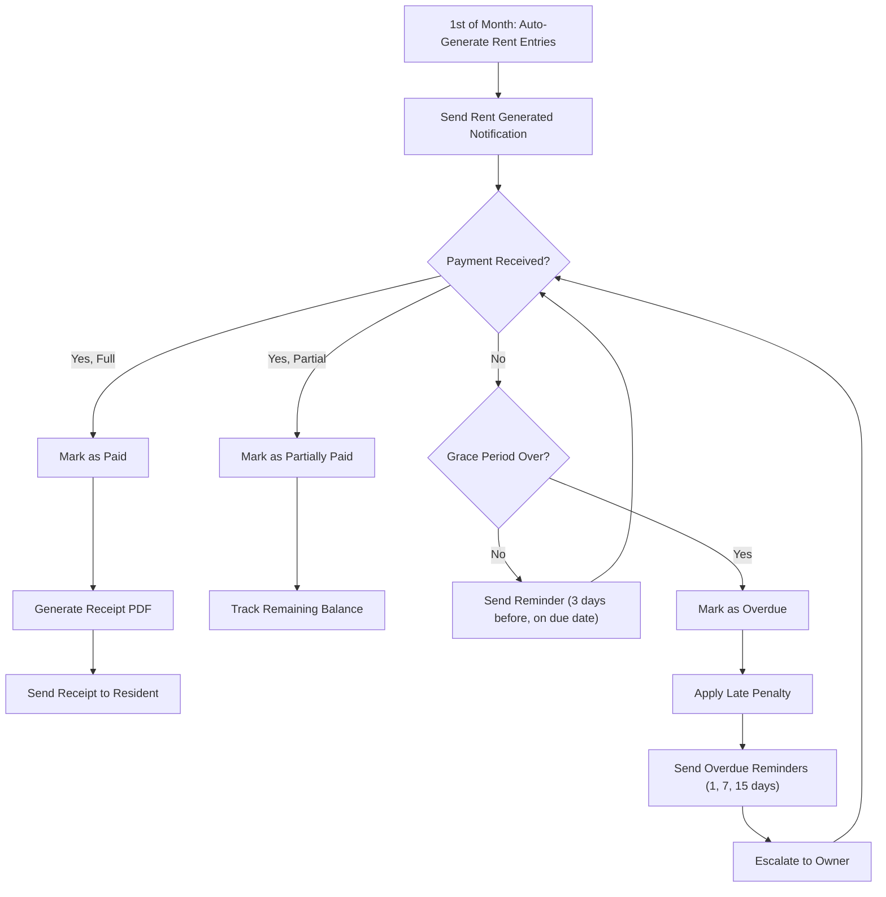

### 18.3 Complaint Workflow

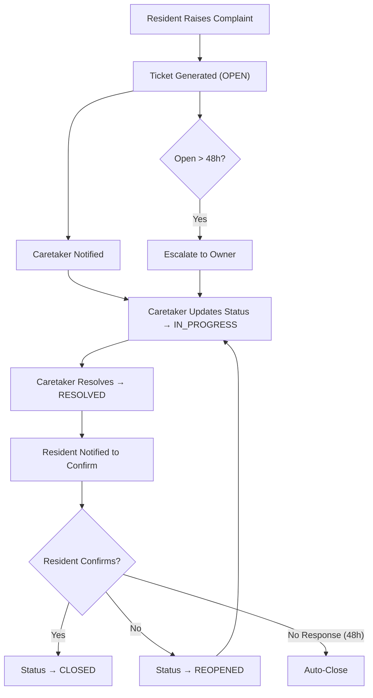

---

## 19. Dependency Map

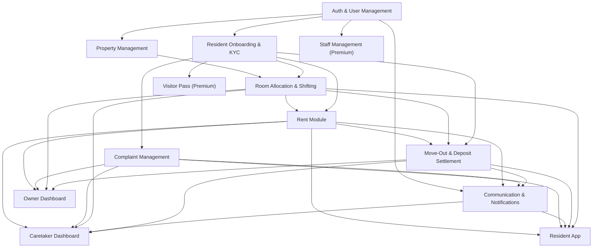

> [!IMPORTANT]
> **Build order must respect this dependency graph.** Authentication and Property Management are foundational and must be implemented first.

---

## 20. RACI Matrix

| Module | Product Manager | Backend Engineer | Frontend Engineer | QA Engineer | Designer |
|---|---|---|---|---|---|
| Auth & User Mgmt | A | R | R | C | C |
| Property Mgmt | A | R | R | C | C |
| Resident Onboarding | A | R | R | C | R |
| Room Allocation | A | R | R | C | C |
| Rent Module | A | R | R | R | C |
| Complaint Mgmt | A | R | R | R | C |
| Move-Out | A | R | R | C | C |
| Communication | A | R | R | C | C |
| Owner Dashboard | A | R | R | C | R |
| Caretaker Dashboard | A | R | R | C | R |
| Resident App | A | R | R | R | R |
| Premium Features | A | R | R | C | C |

**R** = Responsible, **A** = Accountable, **C** = Consulted, **I** = Informed

---

## 21. Phased Release Plan

### Phase 1 — MVP (Weeks 1–8)

| Module | Scope |
|---|---|
| Auth & User Management | OTP login, role-based access, caretaker invite |
| Property Management | Full CRUD for property/floor/room/bed, occupancy view |
| Resident Onboarding | Onboarding form, KYC upload, deposit recording |
| Room Allocation | Basic bed allocation during onboarding |
| Rent Module | Auto-generation, manual payment recording, receipt, overdue tracking |
| Complaint Management | Raise, track, resolve, confirm workflow |
| Communication | In-app announcements, basic push notifications |
| Caretaker Dashboard | Today's tasks, room map, rent progress |
| Owner Dashboard | Multi-property overview, revenue, occupancy, overdue list |
| Resident App | Home screen, rent view, complaints, notices |

### Phase 2 — Enhancements (Weeks 9–14)

| Module | Scope |
|---|---|
| Move-Out & Settlement | Full workflow with inspection and deposit calculation |
| Room Shifting | Shift flow with rent adjustment |
| Food Menu | Create and display daily menu |
| WhatsApp Integration | Rent reminders, complaint updates via WhatsApp |
| Agreement Generation | Digital agreement with e-signature |
| Analytics | Revenue and occupancy trend charts |
| Export | CSV/PDF report exports |

### Phase 3 — Premium (Weeks 15–20)

| Module | Scope |
|---|---|
| Visitor Pass | QR/OTP based visitor management |
| Staff Management | Staff profiles and attendance |
| Security Logs | Entry/exit logging |
| Lead Management | Full lead pipeline |
| Advanced Analytics | Comparative property analytics, predictive insights |
| Multi-Language | Hindi support |

### Phase 4 — Future (Post Week 20)

| Module | Scope |
|---|---|
| Online Payments | UPI / payment gateway integration |
| UPI Auto-Reconciliation | Automatic payment matching |
| WhatsApp Automation | Chatbot-based interactions |
| AI Analytics | Predictive maintenance, churn prediction |
| Vacancy Marketplace | Public vacancy listing and discovery |
| Service Marketplace | Laundry, housekeeping, packers & movers |

---

## 22. Appendix — Data Dictionary

### Core Enums

| Enum | Values |
|---|---|
| `UserRole` | `OWNER`, `CARETAKER`, `RESIDENT`, `SUPER_ADMIN` |
| `PropertyType` | `MALE`, `FEMALE`, `COED` |
| `RoomType` | `SINGLE`, `DOUBLE`, `TRIPLE`, `DORMITORY` |
| `BedStatus` | `VACANT`, `OCCUPIED`, `RESERVED`, `MAINTENANCE` |
| `ResidentStatus` | `ACTIVE`, `ON_NOTICE`, `MOVED_OUT`, `BLACKLISTED` |
| `LeadStatus` | `NEW`, `CONTACTED`, `VISIT_SCHEDULED`, `VISITED`, `CONVERTED`, `LOST` |
| `RentStatus` | `GENERATED`, `PARTIALLY_PAID`, `PAID`, `OVERDUE` |
| `PaymentMode` | `CASH`, `UPI`, `BANK_TRANSFER`, `CHEQUE`, `ONLINE` |
| `ComplaintStatus` | `OPEN`, `IN_PROGRESS`, `RESOLVED`, `CONFIRMED`, `REOPENED`, `CLOSED` |
| `ComplaintCategory` | `PLUMBING`, `ELECTRICAL`, `FURNITURE`, `CLEANLINESS`, `FOOD`, `WIFI`, `NOISE`, `SAFETY`, `MAINTENANCE`, `OTHER` |
| `ComplaintPriority` | `LOW`, `MEDIUM`, `HIGH`, `URGENT` |
| `MoveOutStatus` | `PENDING`, `APPROVED`, `INSPECTION_DONE`, `SETTLED`, `REJECTED`, `CANCELLED` |
| `InspectionCondition` | `GOOD`, `FAIR`, `POOR` |
| `AnnouncementPriority` | `NORMAL`, `URGENT`, `EMERGENCY` |
| `MealType` | `BREAKFAST`, `LUNCH`, `DINNER` |
| `NotificationChannel` | `IN_APP`, `PUSH`, `SMS`, `WHATSAPP`, `EMAIL` |
| `NotificationStatus` | `SENT`, `DELIVERED`, `READ`, `FAILED` |
| `VisitorPassStatus` | `PENDING`, `CHECKED_IN`, `CHECKED_OUT`, `EXPIRED`, `CANCELLED` |
| `StaffRole` | `COOK`, `CLEANER`, `SECURITY`, `MAINTENANCE`, `OTHER` |
| `AttendanceStatus` | `PRESENT`, `ABSENT`, `HALF_DAY`, `LEAVE` |
| `DocumentType` | `AADHAAR_FRONT`, `AADHAAR_BACK`, `PAN`, `PHOTO`, `OTHER` |
| `AdjustmentType` | `DISCOUNT`, `ADDITIONAL_CHARGE`, `ELECTRICITY`, `MEALS`, `OTHER` |

### Standard Fields (All Tables)

| Field | Type | Description |
|---|---|---|
| `id` | UUID | Primary key |
| `created_at` | TIMESTAMP | Record creation time (UTC) |
| `updated_at` | TIMESTAMP | Last modification time (UTC) |

### Indexing Strategy

| Table | Indexed Columns | Index Type |
|---|---|---|
| `user` | `phone_number`, `email`, `role` | B-tree, Unique (phone) |
| `resident` | `property_id`, `status`, `phone`, `user_id` | B-tree |
| `bed` | `room_id`, `status` | B-tree |
| `rent_entry` | `resident_id`, `property_id`, `month + year`, `status` | B-tree, Composite |
| `payment` | `rent_entry_id`, `payment_date` | B-tree |
| `complaint` | `property_id`, `status`, `resident_id`, `created_at` | B-tree |
| `move_out_request` | `resident_id`, `property_id`, `status` | B-tree |
| `announcement` | `property_id`, `created_at`, `priority` | B-tree |
| `notification` | `user_id`, `status`, `sent_at` | B-tree |

---

> [!NOTE]
> This document is a living specification. All requirements are subject to review and refinement during sprint planning. Requirement IDs should be used for traceability in test cases, user stories, and code comments.

---

**Document History**

| Version | Date | Author | Changes |
|---|---|---|---|
| 1.0 | 11 Aug 2026 | Engineering Team | Initial draft — all 12 modules |
