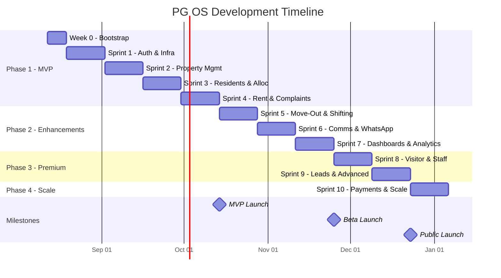
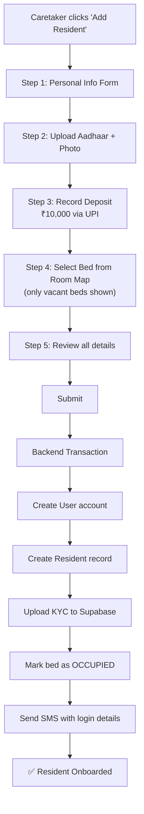
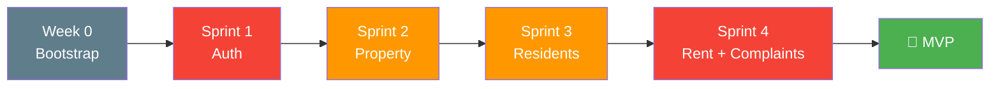

# PG OS — Development Plan

**Version**: 1.0  
**Date**: 11 August 2026  
**Stack**: Spring Boot 3 · React 18 + Vite · PostgreSQL (Neon) · Redis (Upstash)  
**Target**: MVP live in 8 weeks (team) / 14 weeks (solo developer)

---

## Executive Summary

This plan takes PG OS from zero to a deployed, functional MVP in **4 phases across 20 weeks**. Phase 1 (MVP) is the only critical phase — it delivers a usable product for the first paying customer. Phases 2–4 add polish, premium features, and scale.

```
Phase 1: MVP (Weeks 0–8)        → First paying PG owner can use the system
Phase 2: Enhancements (Weeks 9–14)  → Move-out, WhatsApp, analytics, food menu
Phase 3: Premium (Weeks 15–18)      → Visitor pass, staff management, lead pipeline
Phase 4: Scale (Weeks 19–20+)       → Online payments, marketplace, AI features
```

---

## Timeline Overview



---

## Week 0 — Project Bootstrap (Days 1–7)

> [!IMPORTANT]
> This week is purely setup. No feature code. Get the skeleton running end-to-end: an empty Spring Boot API that returns "hello" + an empty React app that calls it — both deployed.

### Day 1–2: Repository & Backend Setup

| Task | Details | Done? |
|---|---|---|
| Create GitHub monorepo `pg-os` | Initialize with README, .gitignore (Java + Node), LICENSE | ☐ |
| Create Spring Boot project | `start.spring.io` → Java 17, Maven, Spring Boot 3.3 | ☐ |
| Add dependencies to `pom.xml` | Spring Web, Spring Security, Spring Data JPA, Flyway, Validation, Lombok, SpringDoc OpenAPI, PostgreSQL driver, Spring Data Redis, Sentry | ☐ |
| Configure `application.yml` profiles | `dev`, `staging`, `production` profiles | ☐ |
| Create health check endpoint | `GET /api/v1/health` → `{ "status": "UP" }` | ☐ |
| Set up local PostgreSQL | Docker Compose with Postgres 15 + Redis 7 | ☐ |
| Configure Flyway | Empty `V1__init.sql` migration, verify it runs | ☐ |
| Test locally | `mvn spring-boot:run` → hit `/api/v1/health` | ☐ |

**`docker-compose.yml` for local dev:**
```yaml
version: '3.8'
services:
  postgres:
    image: postgres:15-alpine
    environment:
      POSTGRES_DB: pgos_dev
      POSTGRES_USER: pgos
      POSTGRES_PASSWORD: pgos_dev_password
    ports:
      - "5432:5432"
    volumes:
      - pgos_data:/var/lib/postgresql/data

  redis:
    image: redis:7-alpine
    ports:
      - "6379:6379"

volumes:
  pgos_data:
```

### Day 3: Frontend Setup

| Task | Details | Done? |
|---|---|---|
| Create React + Vite project | `npx -y create-vite@latest frontend -- --template react` | ☐ |
| Install core dependencies | `react-router-dom`, `axios`, `@tanstack/react-query`, `react-hot-toast` | ☐ |
| Set up project structure | `/api`, `/components`, `/pages`, `/hooks`, `/context`, `/styles`, `/utils` | ☐ |
| Create design system base | `variables.css` (colors, spacing, typography), `index.css` (reset + globals) | ☐ |
| Set up Axios client | Base URL from env, interceptor for JWT header, error handling | ☐ |
| Set up React Router | Basic routes: `/login`, `/owner/*`, `/caretaker/*`, `/resident/*` | ☐ |
| Create placeholder pages | Login, OwnerDashboard, CaretakerDashboard, ResidentHome — all showing "Coming Soon" | ☐ |
| Test locally | `npm run dev` → Navigate between routes | ☐ |

### Day 4: CI/CD Pipeline

| Task | Details | Done? |
|---|---|---|
| Create `backend-ci.yml` | Build + test on every PR (backend paths) | ☐ |
| Create `frontend-ci.yml` | Lint + test + build on every PR (frontend paths) | ☐ |
| Create `Dockerfile` for backend | Multi-stage build (JDK build → JRE run) | ☐ |
| Set up Render account | Create Web Service → connect GitHub repo → `backend/` root dir | ☐ |
| Set up Vercel account | Import repo → set `frontend/` as root → auto-deploy | ☐ |
| Configure env vars on Render | DB URL, Redis, JWT secret, etc. | ☐ |
| Configure env vars on Vercel | `VITE_API_URL` pointing to Render backend URL | ☐ |
| Verify deployment | Push to main → both deploy → frontend calls backend health check | ☐ |

### Day 5: Database & External Services

| Task | Details | Done? |
|---|---|---|
| Create Neon account | Free tier → create `pgos-dev` and `pgos-prod` projects | ☐ |
| Create Upstash account | Free tier → create Redis database | ☐ |
| Create Supabase account | Free tier → create storage bucket for KYC docs | ☐ |
| Create Resend account | Free tier → verify sender domain | ☐ |
| Create Sentry projects | One for backend (Java), one for frontend (React) | ☐ |
| Update Render env vars | Point to Neon + Upstash connection strings | ☐ |
| Verify production DB | Push a test migration, verify on Neon dashboard | ☐ |

### Day 6–7: Code Quality & Standards

| Task | Details | Done? |
|---|---|---|
| Add Checkstyle config | Google Java Style (customized) | ☐ |
| Add SpotBugs plugin | Maven plugin config | ☐ |
| Add ESLint + Prettier | Frontend lint config | ☐ |
| Add pre-commit hooks | Husky (frontend) for lint-staged | ☐ |
| Add JaCoCo | Coverage reporting for backend | ☐ |
| Create `.env.example` | Template for all env vars | ☐ |
| Write README.md | Setup instructions, architecture overview | ☐ |
| Create `CONTRIBUTING.md` | Branch naming, commit conventions, PR process | ☐ |
| Set up keep-alive cron | GitHub Action pinging Render every 14 min | ☐ |

### Week 0 Definition of Done ✅

```
✅ Spring Boot API running on Render (free) at https://your-api.onrender.com
✅ React app running on Vercel (free) at https://your-app.vercel.app
✅ Frontend successfully calls backend /health endpoint
✅ PostgreSQL on Neon, Redis on Upstash — connected and working
✅ GitHub Actions CI runs on every PR (build + lint)
✅ Auto-deploy on merge to main
✅ Local dev works via docker-compose
```

---

## Sprint 1 — Authentication & Core Infrastructure (Weeks 1–2)

### Sprint Goal
> A user (Owner, Caretaker, or Resident) can log in via phone + OTP, receive JWT tokens, and access role-appropriate routes.

### Backend Tasks

| # | Task | Story Points | Priority |
|---|---|---|---|
| 1.1 | Create `V1__create_users_table.sql` migration — users table with role enum | 2 | P0 |
| 1.2 | Create `User` entity + `UserRepository` | 2 | P0 |
| 1.3 | Create `OtpService` — generate, store (Redis TTL 5 min), verify OTP | 3 | P0 |
| 1.4 | Create `JwtService` — generate access token (15 min), refresh token (7 days), validate, extract claims | 5 | P0 |
| 1.5 | Create `AuthController` — `POST /auth/otp/send`, `POST /auth/otp/verify`, `POST /auth/refresh`, `POST /auth/logout` | 5 | P0 |
| 1.6 | Create `JwtAuthFilter` — extract JWT from Authorization header, validate, set SecurityContext | 5 | P0 |
| 1.7 | Configure `SecurityConfig` — permit auth endpoints, secure all others, CORS for frontend | 3 | P0 |
| 1.8 | Create `GlobalExceptionHandler` — standard error response format `{ error, message, timestamp, path }` | 2 | P0 |
| 1.9 | Create `ApiResponse<T>` wrapper — standard success response `{ success, data, message }` | 1 | P0 |
| 1.10 | Create `V2__create_auth_events_table.sql` — login/logout audit trail | 1 | P1 |
| 1.11 | Write unit tests for `OtpService`, `JwtService` | 3 | P0 |
| 1.12 | Write integration tests for `AuthController` | 3 | P0 |
| | **Backend Total** | **35** | |

### Frontend Tasks

| # | Task | Story Points | Priority |
|---|---|---|---|
| 1.13 | Create `AuthContext` — store user, tokens, login/logout methods | 3 | P0 |
| 1.14 | Create `useAuth` hook — expose context with convenience methods | 2 | P0 |
| 1.15 | Create `ProtectedRoute` component — redirect to login if not authenticated | 2 | P0 |
| 1.16 | Create `RoleRoute` component — redirect based on user role (Owner/Caretaker/Resident) | 2 | P0 |
| 1.17 | Build Login Page — phone input → send OTP → verify OTP → redirect to dashboard | 5 | P0 |
| 1.18 | Build OTP input component — 6-digit auto-focus, auto-submit, resend timer | 3 | P0 |
| 1.19 | Set up Axios interceptor — attach JWT, handle 401 (auto-refresh), handle 403 | 3 | P0 |
| 1.20 | Create skeleton layouts — `OwnerLayout`, `CaretakerLayout`, `ResidentLayout` with sidebar/nav | 5 | P1 |
| 1.21 | Write component tests for LoginPage, OTP input | 2 | P1 |
| | **Frontend Total** | **27** | |

### Sprint 1 Database Schema

```sql
-- V1__create_users_table.sql
CREATE EXTENSION IF NOT EXISTS "uuid-ossp";

CREATE TYPE user_role AS ENUM ('SUPER_ADMIN', 'OWNER', 'CARETAKER', 'RESIDENT');

CREATE TABLE users (
    id UUID PRIMARY KEY DEFAULT uuid_generate_v4(),
    phone_number VARCHAR(15) UNIQUE NOT NULL,
    email VARCHAR(255),
    password_hash VARCHAR(255),
    role user_role NOT NULL,
    full_name VARCHAR(255) NOT NULL,
    avatar_url TEXT,
    is_active BOOLEAN DEFAULT TRUE,
    last_login_at TIMESTAMPTZ,
    created_at TIMESTAMPTZ DEFAULT NOW(),
    updated_at TIMESTAMPTZ DEFAULT NOW()
);

CREATE INDEX idx_users_phone ON users(phone_number);
CREATE INDEX idx_users_role ON users(role);

-- V2__create_auth_events_table.sql
CREATE TYPE auth_event_type AS ENUM (
    'OTP_SENT', 'OTP_VERIFIED', 'LOGIN', 'LOGOUT',
    'FAILED_LOGIN', 'TOKEN_REFRESH', 'PASSWORD_RESET'
);

CREATE TABLE auth_events (
    id UUID PRIMARY KEY DEFAULT uuid_generate_v4(),
    user_id UUID REFERENCES users(id),
    event_type auth_event_type NOT NULL,
    ip_address VARCHAR(45),
    user_agent TEXT,
    metadata JSONB,
    created_at TIMESTAMPTZ DEFAULT NOW()
);

CREATE INDEX idx_auth_events_user ON auth_events(user_id);
CREATE INDEX idx_auth_events_created ON auth_events(created_at);
```

### Sprint 1 API Contract

| Method | Endpoint | Request Body | Response | Status |
|---|---|---|---|---|
| `POST` | `/api/v1/auth/otp/send` | `{ "phoneNumber": "9876543210" }` | `{ "otpRef": "ref_xxx", "expiresIn": 300 }` | 200 |
| `POST` | `/api/v1/auth/otp/verify` | `{ "phoneNumber": "...", "otp": "123456", "otpRef": "ref_xxx" }` | `{ "accessToken": "...", "refreshToken": "...", "user": {...} }` | 200 |
| `POST` | `/api/v1/auth/refresh` | `{ "refreshToken": "..." }` | `{ "accessToken": "...", "refreshToken": "..." }` | 200 |
| `POST` | `/api/v1/auth/logout` | — | `{ "message": "Logged out" }` | 200 |
| `GET` | `/api/v1/auth/me` | — | `{ "user": {...} }` | 200 |

### Sprint 1 Definition of Done ✅

```
✅ Owner can log in via phone + OTP
✅ JWT tokens are issued and refresh works
✅ Role-based routing works (owner → owner dashboard, caretaker → caretaker dashboard)
✅ Unauthorized access returns 401/403
✅ Auth audit events are logged
✅ Unit + integration tests pass (≥80% coverage on auth module)
✅ Deployed and working on staging
```

---

## Sprint 2 — Property Management (Weeks 3–4)

### Sprint Goal
> Owner can create a property with floors, rooms, and beds. Caretaker can view the room map with occupancy status. Owner can invite a caretaker.

### Backend Tasks

| # | Task | SP | Priority |
|---|---|---|---|
| 2.1 | Create `V3__create_property_tables.sql` — properties, floors, rooms, beds, property_images | 3 | P0 |
| 2.2 | Create entities — `Property`, `Floor`, `Room`, `Bed`, `PropertyImage` | 3 | P0 |
| 2.3 | Create repositories — Spring Data JPA repos for all entities | 2 | P0 |
| 2.4 | Create `PropertyService` — CRUD with owner validation | 5 | P0 |
| 2.5 | Create `PropertyController` — All property endpoints with `@PreAuthorize` | 5 | P0 |
| 2.6 | Implement occupancy calculation — percentage at property/floor/room level | 3 | P0 |
| 2.7 | Create room map API — returns structured data grouped by floor with bed status + resident name | 3 | P0 |
| 2.8 | Implement caretaker invite — Owner sends invite → caretaker gets SMS → auto-associate on signup | 5 | P0 |
| 2.9 | Create `V4__create_caretaker_assignments.sql` — many-to-many between caretakers and properties | 2 | P0 |
| 2.10 | Implement property config — notice period, deposit amount, penalty %, grace period | 2 | P1 |
| 2.11 | Write unit tests for `PropertyService`, occupancy calculation | 3 | P0 |
| 2.12 | Write integration tests for `PropertyController` | 3 | P0 |
| | **Backend Total** | **39** | |

### Frontend Tasks

| # | Task | SP | Priority |
|---|---|---|---|
| 2.13 | Build "Add Property" wizard — Step 1: Basic Info, Step 2: Floors & Rooms, Step 3: Config, Step 4: Review | 8 | P0 |
| 2.14 | Build `PropertyList` page — cards with name, address, occupancy %, vacancy count | 5 | P0 |
| 2.15 | Build `PropertyDetail` page — tabs for Overview, Room Map, Residents, Settings | 5 | P0 |
| 2.16 | Build `RoomMap` component — grid of beds per floor, color-coded by status | 8 | P0 |
| 2.17 | Build "Invite Caretaker" modal — phone number input, property selection | 3 | P0 |
| 2.18 | Build reusable form components — Input, Select, MultiStepForm, FileUpload | 5 | P1 |
| 2.19 | Write component tests | 2 | P1 |
| | **Frontend Total** | **36** | |

### Sprint 2 Key Screens

```
┌─────────────────────────────────────────────────────────┐
│ PROPERTY LIST (Owner View)                               │
├─────────────────────────────────────────────────────────┤
│                                                          │
│  ┌──────────────┐  ┌──────────────┐  ┌──────────────┐  │
│  │ 🏠 Sunrise PG │  │ 🏠 Green PG  │  │  ➕ Add New  │  │
│  │              │  │              │  │              │  │
│  │ Occupancy 85%│  │ Occupancy 62%│  │              │  │
│  │ █████████░░  │  │ ██████░░░░  │  │    + Add     │  │
│  │              │  │              │  │   Property   │  │
│  │ 3 Vacant     │  │ 8 Vacant     │  │              │  │
│  │ ₹12.4L/month │  │ ₹8.2L/month  │  │              │  │
│  └──────────────┘  └──────────────┘  └──────────────┘  │
│                                                          │
└─────────────────────────────────────────────────────────┘

┌─────────────────────────────────────────────────────────┐
│ ROOM MAP (Caretaker View) — Sunrise PG                   │
├─────────────────────────────────────────────────────────┤
│ Floor 1                                                  │
│ ┌─────────┐ ┌─────────┐ ┌─────────┐ ┌─────────┐       │
│ │ R101-A  │ │ R101-B  │ │ R102-A  │ │ R102-B  │       │
│ │ 🟢 Vacant│ │ 🔴 Rahul│ │ 🔴 Amit │ │ 🟡 Rsrvd│       │
│ └─────────┘ └─────────┘ └─────────┘ └─────────┘       │
│ Floor 2                                                  │
│ ┌─────────┐ ┌─────────┐ ┌─────────┐ ┌─────────┐       │
│ │ R201-A  │ │ R201-B  │ │ R202-A  │ │ R202-B  │       │
│ │ 🔴 Vijay│ │ 🔴 Suresh│ │ ⚪ Maint│ │ 🟢 Vacant│       │
│ └─────────┘ └─────────┘ └─────────┘ └─────────┘       │
│                                                          │
│ 🟢 Vacant (2)  🔴 Occupied (4)  🟡 Reserved (1)  ⚪ Maintenance (1) │
└─────────────────────────────────────────────────────────┘
```

### Sprint 2 Definition of Done ✅

```
✅ Owner can create a property with floors → rooms → beds
✅ Room map shows correct occupancy with color coding
✅ Owner can invite a caretaker who auto-associates on signup
✅ Occupancy % is calculated correctly at all levels
✅ Property CRUD is protected by role (only owner can edit)
✅ Deployed and working
```

---

## Sprint 3 — Resident Onboarding & Room Allocation (Weeks 5–6)

### Sprint Goal
> Caretaker can onboard a resident (personal info + KYC + deposit + bed allocation) in one flow. Resident can log in and see their profile.

### Backend Tasks

| # | Task | SP | Priority |
|---|---|---|---|
| 3.1 | Create `V5__create_resident_tables.sql` — residents, kyc_documents, agreements | 3 | P0 |
| 3.2 | Create entities + repositories | 3 | P0 |
| 3.3 | Create `ResidentService` — onboarding flow (create user + resident + KYC + allocate bed — all in one transaction) | 8 | P0 |
| 3.4 | Create `KycService` — upload to Supabase Storage, store URL, signed URL generation | 5 | P0 |
| 3.5 | Create `AllocationService` — allocate bed (with double-allocation lock), update bed status | 5 | P0 |
| 3.6 | Create `ResidentController` — CRUD + search/filter + pagination | 5 | P0 |
| 3.7 | Create `AgreementService` — generate agreement PDF from template (OpenPDF) | 5 | P1 |
| 3.8 | Send SMS to resident with login credentials after onboarding | 2 | P0 |
| 3.9 | Implement resident search — by name, phone, room, status | 3 | P0 |
| 3.10 | Write unit + integration tests | 5 | P0 |
| | **Backend Total** | **44** | |

### Frontend Tasks

| # | Task | SP | Priority |
|---|---|---|---|
| 3.11 | Build "Onboard Resident" wizard — Step 1: Personal Info, Step 2: KYC Upload, Step 3: Deposit & Payment, Step 4: Bed Selection (from room map), Step 5: Review & Submit | 13 | P0 |
| 3.12 | Build KYC upload component — drag-drop, preview, Aadhaar front/back, photo | 5 | P0 |
| 3.13 | Build `ResidentList` page — table with search, filter by status/floor/room | 5 | P0 |
| 3.14 | Build `ResidentProfile` page — personal info, room details, KYC docs, deposit info | 5 | P0 |
| 3.15 | Build Resident Home Screen (basic) — greeting, room info, profile link | 3 | P0 |
| 3.16 | Build Resident Profile Edit — phone, email, emergency contact, photo | 3 | P1 |
| 3.17 | Write component tests | 2 | P1 |
| | **Frontend Total** | **36** | |

### Sprint 3 Key Workflow



### Sprint 3 Definition of Done ✅

```
✅ Caretaker completes full onboarding in one flow
✅ KYC documents uploaded and viewable
✅ Bed status changes to OCCUPIED on allocation
✅ Double-allocation is prevented (concurrent requests)
✅ Resident receives SMS and can log in
✅ Resident sees their profile with room details
✅ Search and filter works on resident list
```

---

## Sprint 4 — Rent, Complaints & Basic Dashboards (Weeks 7–8)

### Sprint Goal
> Monthly rent is auto-generated. Caretaker records payments and receipts are generated. Residents can raise and track complaints. Basic owner + caretaker dashboards show key metrics.

### Backend Tasks

| # | Task | SP | Priority |
|---|---|---|---|
| 4.1 | Create `V6__create_rent_tables.sql` — rent_entries, payments, rent_adjustments | 3 | P0 |
| 4.2 | Create `RentScheduler` — `@Scheduled` cron job to generate rent entries on 1st of month | 5 | P0 |
| 4.3 | Create `RentService` — generate, mark paid, partial payment, overdue detection | 8 | P0 |
| 4.4 | Create `ReceiptService` — generate PDF receipt with OpenPDF | 5 | P0 |
| 4.5 | Create `RentController` — list entries, record payment, download receipt | 5 | P0 |
| 4.6 | Create overdue detection job — daily check, apply penalty, update status | 3 | P0 |
| 4.7 | Create `V7__create_complaint_tables.sql` — complaints, complaint_images, complaint_comments | 2 | P0 |
| 4.8 | Create `ComplaintService` — raise, update status, add comment, auto-close (48h) | 5 | P0 |
| 4.9 | Create `ComplaintController` — CRUD + status transitions + image upload | 5 | P0 |
| 4.10 | Create `V8__create_announcement_tables.sql` — announcements, notifications | 2 | P0 |
| 4.11 | Create `AnnouncementService` — create announcement, send in-app notification | 3 | P0 |
| 4.12 | Create `DashboardService` — aggregate queries for owner (revenue, occupancy, overdue) and caretaker (tasks, rent progress) | 8 | P0 |
| 4.13 | Write unit + integration tests | 5 | P0 |
| | **Backend Total** | **59** | |

### Frontend Tasks

| # | Task | SP | Priority |
|---|---|---|---|
| 4.14 | Build `RentCollection` page (Caretaker) — list pending rents, record payment modal | 8 | P0 |
| 4.15 | Build `RecordPayment` modal — amount, mode, transaction ref, date | 3 | P0 |
| 4.16 | Build `RentHistory` page (Resident) — list of months with status badges + download receipt | 5 | P0 |
| 4.17 | Build `RaiseComplaint` form (Resident) — category dropdown, description, image upload (3 max) | 5 | P0 |
| 4.18 | Build `ComplaintList` page — list with status badges, click to view details | 3 | P0 |
| 4.19 | Build `ComplaintDetail` page — timeline view, comments, confirm/reopen buttons (resident) | 5 | P0 |
| 4.20 | Build `OwnerDashboard` — revenue card, occupancy gauge, pending rent alert, overdue table, complaints ticker | 8 | P0 |
| 4.21 | Build `CaretakerDashboard` — today's tasks, rent progress bar, quick action buttons, room map mini | 8 | P0 |
| 4.22 | Build `ResidentHome` (complete) — rent card, active complaints, recent notices, quick actions | 5 | P0 |
| 4.23 | Build `Announcements` page — list of notices for residents | 3 | P0 |
| 4.24 | Build reusable `StatusBadge`, `MetricCard`, `ProgressBar` components | 3 | P1 |
| 4.25 | Write component tests | 3 | P1 |
| | **Frontend Total** | **59** | |

> [!WARNING]
> This is the largest sprint. If working solo, split into:
> - **Sprint 4a** (Week 7): Rent backend + frontend + receipt generation
> - **Sprint 4b** (Week 8): Complaints + dashboards + announcements

### Sprint 4 Definition of Done ✅ = 🚀 MVP LAUNCH

```
✅ Rent entries auto-generated monthly (or manually triggered for testing)
✅ Caretaker can record payment → PDF receipt generated → resident can download
✅ Overdue detection works with penalty calculation
✅ Resident can raise complaint with images → caretaker resolves → resident confirms
✅ Owner dashboard shows revenue, occupancy, pending rent, complaints
✅ Caretaker dashboard shows today's tasks, rent progress
✅ Resident home screen shows rent status, complaints, notices
✅ Announcements can be posted and viewed
✅ ALL deployed to production
✅ First PG owner can use the system end-to-end
```

---

## Sprint 5 — Move-Out & Room Shifting (Weeks 9–10)

### Sprint Goal
> Resident can request move-out. Caretaker conducts inspection, settlement is calculated, deposit refunded. Room shifting works with rent adjustment.

### Tasks Summary

| Area | Key Deliverables | SP |
|---|---|---|
| **Backend** | Move-out request API, inspection recording, deposit settlement calculation, settlement PDF, room shift API with rent adjustment, vacancy auto-generation | 35 |
| **Frontend** | Move-out request form (resident), move-out processing wizard (caretaker), settlement view, room shift flow, allocation history view | 30 |

### Sprint 5 Definition of Done ✅

```
✅ Resident submits move-out request → caretaker approves
✅ Caretaker records inspection with damage items
✅ System calculates: deposit − pending rent − damages = refund
✅ Settlement PDF generated and downloadable
✅ Bed status changes to VACANT after completion
✅ Room shift works: old bed → vacant, new bed → occupied, rent updated
```

---

## Sprint 6 — Communication & WhatsApp (Weeks 11–12)

### Sprint Goal
> WhatsApp rent reminders, food menu management, emergency broadcasts, and notification preferences.

### Tasks Summary

| Area | Key Deliverables | SP |
|---|---|---|
| **Backend** | WhatsApp Business API integration (Meta Cloud API), rent reminder scheduler (3 days before, due date, overdue), food menu CRUD, emergency broadcast endpoint, notification delivery service (in-app + push + WhatsApp + SMS), notification preferences per property | 40 |
| **Frontend** | Food menu creation UI (caretaker), food menu display (resident), notification center with unread badges, emergency broadcast button, notification settings | 25 |

### Sprint 6 Definition of Done ✅

```
✅ Rent reminders sent via WhatsApp on schedule
✅ Caretaker posts daily food menu → residents see it in app
✅ Emergency broadcast sends via all channels
✅ Notification bell shows unread count + notification list
```

---

## Sprint 7 — Dashboards & Analytics (Weeks 13–14)

### Sprint Goal
> Rich analytics dashboards with trend charts, data export, and a polished UI across all three personas.

### Tasks Summary

| Area | Key Deliverables | SP |
|---|---|---|
| **Backend** | Revenue trend API (last 6 months), occupancy trend API, complaint analytics API, CSV/PDF export service, multi-property comparison API | 25 |
| **Frontend** | Revenue trend line chart (Recharts/Chart.js), occupancy area chart, complaint breakdown pie chart, export buttons (CSV/PDF), multi-property comparison table, UI polish pass — animations, transitions, responsive fixes, empty states, loading skeletons | 35 |

### Sprint 7 Definition of Done ✅ = 🎯 BETA LAUNCH

```
✅ Owner sees revenue and occupancy trends (6 months)
✅ Complaint analytics with category breakdown
✅ Export to CSV/PDF works
✅ All screens are polished, responsive, and production-ready
✅ System is ready for beta users (3–5 PG owners)
```

---

## Sprint 8 — Visitor Pass & Staff Management (Weeks 15–16)

### Tasks Summary

| Area | Key Deliverables | SP |
|---|---|---|
| **Backend** | Visitor pass CRUD, QR code generation (ZXing library), OTP-based visitor verification, visitor check-in/check-out logging, staff CRUD, staff attendance API | 30 |
| **Frontend** | Visitor request form (resident), visitor pass with QR code display, QR scanner page (caretaker), visitor logs (owner), staff management CRUD UI, attendance marking UI | 30 |

---

## Sprint 9 — Lead Pipeline & Advanced Features (Weeks 17–18)

### Tasks Summary

| Area | Key Deliverables | SP |
|---|---|---|
| **Backend** | Lead CRUD, lead status pipeline API, lead-to-resident conversion, digital agreement with OTP e-sign, multi-language API support (i18n), audit trail API | 30 |
| **Frontend** | Lead pipeline kanban board, lead detail with conversion button, agreement signing flow (resident), language toggle (EN/HI), activity log viewer | 30 |

### Sprint 9 Definition of Done ✅ = 🌍 PUBLIC LAUNCH

```
✅ Complete lead-to-move-out lifecycle works
✅ Premium features (visitor, staff) functional
✅ Hindi language support
✅ System is ready for public launch
```

---

## Sprint 10 — Online Payments & Scale Prep (Weeks 19–20)

### Tasks Summary

| Area | Key Deliverables | SP |
|---|---|---|
| **Backend** | Razorpay integration (payment gateway), UPI payment link generation, webhook for payment confirmation, auto-reconciliation, subscription/billing module for PG OS itself | 35 |
| **Frontend** | "Pay Now" button on resident rent screen, payment confirmation page, payment success/failure screens, owner billing/subscription management | 20 |

---

## Solo Developer Timeline

> [!IMPORTANT]
> If you're building this alone, the timeline stretches but the scope stays the same. Here's the adjusted plan:

| Sprint | Team (2 devs) | Solo Developer | Key Adjustment |
|---|---|---|---|
| Week 0 | 1 week | 1 week | Same |
| Sprint 1 (Auth) | 2 weeks | 3 weeks | Take extra time for auth — it's critical |
| Sprint 2 (Property) | 2 weeks | 3 weeks | Skip property images initially |
| Sprint 3 (Residents) | 2 weeks | 3 weeks | Skip agreement PDF initially |
| Sprint 4a (Rent) | 1 week | 2 weeks | — |
| Sprint 4b (Complaints + Dashboards) | 1 week | 2 weeks | Simpler dashboard initially |
| **MVP Total** | **8 weeks** | **14 weeks** | |
| Sprint 5–10 | 12 weeks | 20 weeks | Same proportional stretch |

### Solo Developer Daily Schedule

```
┌──────────────────────────────────────────────┐
│         IDEAL DAY (8 hours)                  │
├──────────────────────────────────────────────┤
│  9:00 – 9:30   Review yesterday's work      │
│  9:30 – 12:30  Backend development (3h)      │
│  12:30 – 1:30  Break                         │
│  1:30 – 4:30   Frontend development (3h)     │
│  4:30 – 5:30   Testing + bug fixes (1h)      │
│  5:30 – 6:00   Git commit + push + review    │
└──────────────────────────────────────────────┘
```

---

## Risk Register

| # | Risk | Probability | Impact | Mitigation |
|---|---|---|---|---|
| R1 | Render free tier cold starts cause poor UX | High | Medium | Keep-alive cron + lazy init + JVM optimization. Upgrade to $7/mo if needed. |
| R2 | Neon 0.5 GB limit reached before revenue | Medium | High | Monitor storage. Purge old logs. Upgrade at 50 residents. |
| R3 | SMS/WhatsApp costs exceed trial credits | Medium | Low | Start with WhatsApp (1K free). Add SMS only for OTP. |
| R4 | Scope creep delays MVP | High | High | Ruthlessly cut P1/P2 features from MVP. Only P0 ships in Sprint 4. |
| R5 | No users after MVP launch | Medium | High | Have 1–2 PG owners committed before starting development. |
| R6 | Complex multi-tenancy bugs | Medium | High | Thorough integration tests. Test with 2+ owners from Sprint 2. |
| R7 | Solo developer burnout | High | High | Set realistic weekly targets. Take weekends off. Ship imperfect. |

---

## Definition of Done (Global)

Every task is "done" when:

```markdown
- [ ] Code is written and self-reviewed
- [ ] Unit tests pass with ≥80% coverage on new code
- [ ] No lint errors (Checkstyle + ESLint)
- [ ] API matches the contract (request/response format)
- [ ] UI is responsive (mobile + desktop)
- [ ] Error states are handled (loading, empty, error)
- [ ] Committed to feature branch with descriptive message
- [ ] PR opened with description of changes
- [ ] CI pipeline passes (build + test + lint)
- [ ] Deployed to staging and manually verified
- [ ] Merged to main → auto-deployed to production
```

---

## Critical Path



**Red = critical path items (cannot be parallelized)**

| Dependency | Why |
|---|---|
| Auth → Everything | All APIs need authentication |
| Property → Residents | Residents are allocated to beds in properties |
| Residents → Rent | Rent is generated per resident |
| Rent → Dashboard | Dashboard shows rent data |

**Can be parallelized (with 2 devs):**
- Frontend Sprint N + Backend Sprint N (same sprint, different layers)
- Complaints module is independent of Rent (after Residents are done)
- Dashboard APIs can be built while dashboard UI is being designed

---

## How to Start Right Now

```
Step 1: Create the GitHub repo
Step 2: Follow Week 0, Day 1-2 tasks
Step 3: Get "Hello World" deployed on Render + Vercel
Step 4: Start Sprint 1
```

> [!TIP]
> **Don't overthink it. Start coding.** The plan is here — follow it sprint by sprint. Adjust as you learn. Ship the MVP, find one paying customer, then iterate.
