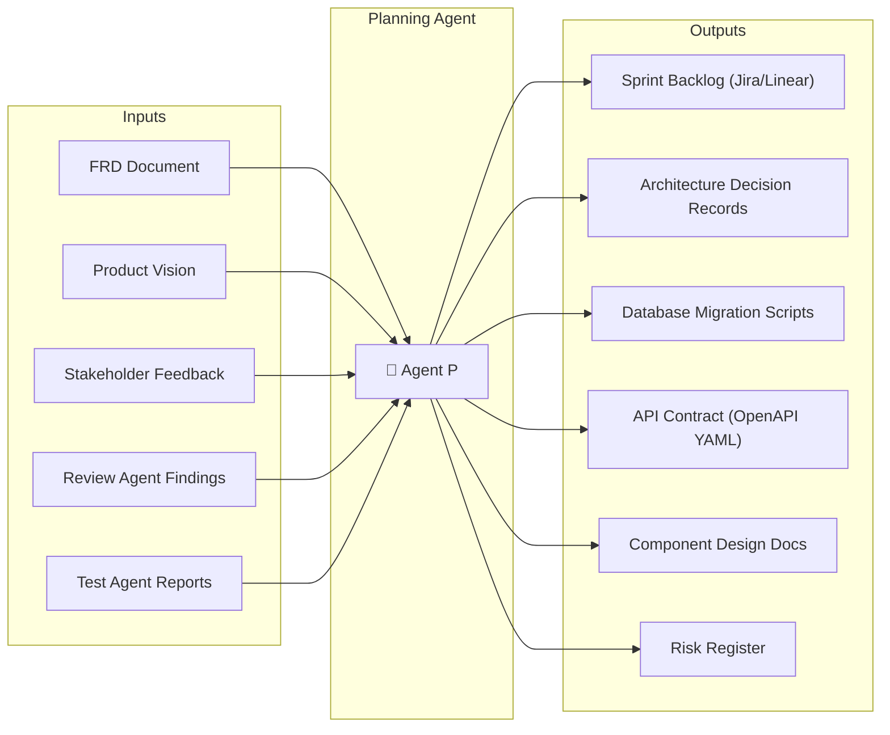
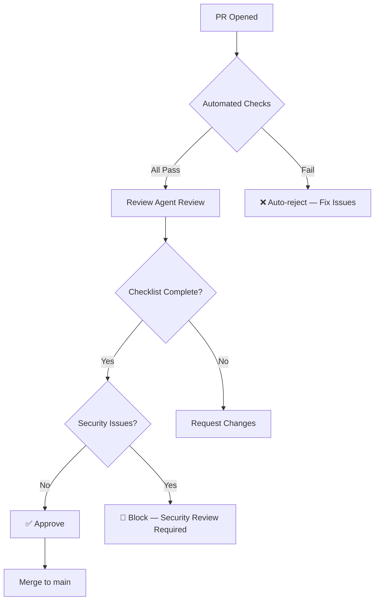
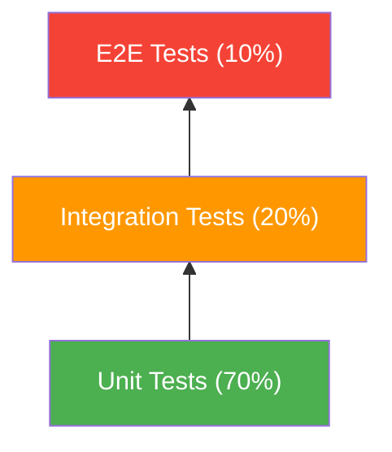
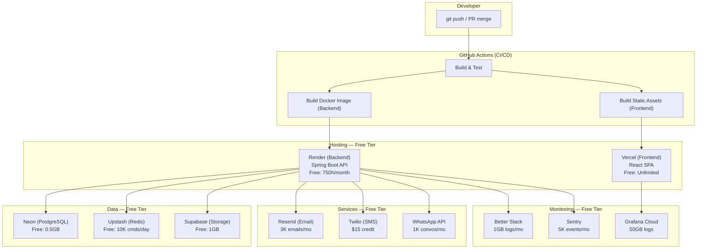
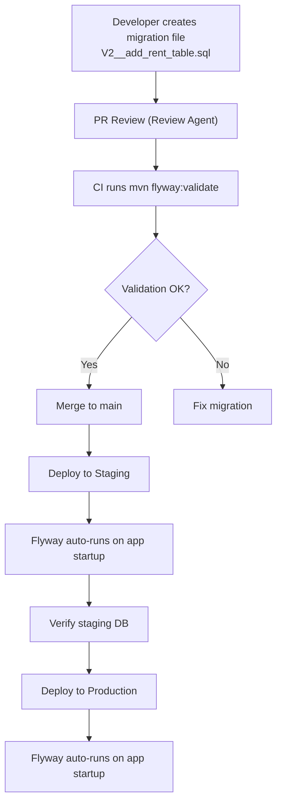
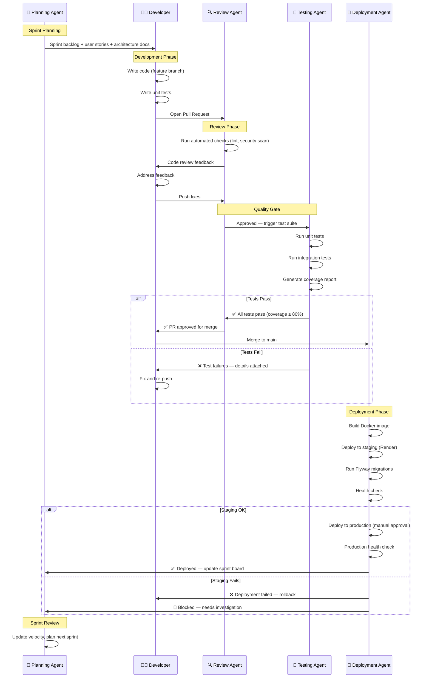
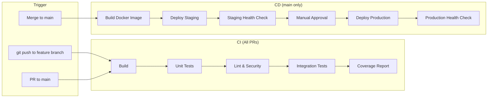

# PG OS — Agent System & DevOps Blueprint

**Version**: 1.0  
**Date**: 11 August 2026  
**Stack**: Spring Boot 3 · React 18 + Vite · PostgreSQL · Redis  

---

## Table of Contents

1. [Tech Stack Decisions](#1-tech-stack-decisions)
2. [Agent 1 — Planning Agent](#2-agent-1--planning-agent)
3. [Agent 2 — Review Agent](#3-agent-2--review-agent)
4. [Agent 3 — Testing Agent](#4-agent-3--testing-agent)
5. [Agent 4 — Deployment Agent](#5-agent-4--deployment-agent)
6. [Agent Interaction Workflow](#6-agent-interaction-workflow)
7. [Free-Tier Deployment Architecture](#7-free-tier-deployment-architecture)
8. [Repository Structure](#8-repository-structure)
9. [CI/CD Pipeline](#9-cicd-pipeline)
10. [Operational Runbooks](#10-operational-runbooks)

---

## 1. Tech Stack Decisions

### 1.1 Final Stack

| Layer | Technology | Justification |
|---|---|---|
| **Backend** | Spring Boot 3.x (Java 17+) | Mature ecosystem, excellent security (Spring Security), JPA/Hibernate ORM, strong typing |
| **Frontend** | React 18 + Vite | Fast dev server, component ecosystem, PWA-ready for Resident App |
| **Database** | PostgreSQL 15+ | JSONB for flexible fields, strong relational model, excellent free tiers available |
| **Cache** | Redis | Session management, OTP storage, rate limiting |
| **File Storage** | Cloudflare R2 (free 10 GB) or Supabase Storage | KYC documents, receipts, images |
| **Auth** | Spring Security + JWT (RS256) | Role-based access, stateless API auth |
| **API Docs** | SpringDoc OpenAPI (Swagger) | Auto-generated API documentation |
| **Build Tool** | Maven | Standard for Spring Boot projects |
| **Package Manager** | npm | React dependency management |

### 1.2 Free-Tier Service Selection

> [!IMPORTANT]
> All services below have **generous free tiers** sufficient for MVP and early users (up to ~100 residents).

| Service | Provider | Free Tier Limits | Purpose |
|---|---|---|---|
| **Backend Hosting** | [Render](https://render.com) | 750 hours/month, auto-sleep after 15 min inactivity | Spring Boot API server |
| **Frontend Hosting** | [Vercel](https://vercel.com) | Unlimited deploys, 100 GB bandwidth | React SPA hosting |
| **Database** | [Neon](https://neon.tech) | 0.5 GB storage, autoscaling, branching | PostgreSQL |
| **Redis** | [Upstash](https://upstash.com) | 10,000 commands/day, 256 MB | Cache, OTP, sessions |
| **File Storage** | [Supabase Storage](https://supabase.com) | 1 GB storage, 2 GB bandwidth | KYC docs, receipts |
| **Email** | [Resend](https://resend.com) | 3,000 emails/month | Transactional emails |
| **WhatsApp** | [WhatsApp Business API via Meta](https://developers.facebook.com) | 1,000 conversations/month free | Notifications |
| **SMS** | [Twilio](https://twilio.com) | $15 free trial credit | OTP delivery |
| **CI/CD** | [GitHub Actions](https://github.com) | 2,000 minutes/month (free) | Build, test, deploy |
| **Monitoring** | [Better Stack (formerly Logtail)](https://betterstack.com) | 1 GB logs/month | Logging & uptime |
| **Error Tracking** | [Sentry](https://sentry.io) | 5,000 events/month | Error monitoring |
| **APM** | [Grafana Cloud](https://grafana.com) | 50 GB logs, 10K metrics | Performance monitoring |

### 1.3 Cost Estimate (MVP Phase)

| Item | Monthly Cost |
|---|---|
| Backend (Render free) | ₹0 |
| Frontend (Vercel free) | ₹0 |
| Database (Neon free) | ₹0 |
| Redis (Upstash free) | ₹0 |
| Storage (Supabase free) | ₹0 |
| Email (Resend free) | ₹0 |
| SMS (Twilio trial) | ₹0 (trial credit) |
| Domain Name | ~₹800/year (~₹67/month) |
| **Total MVP** | **~₹67/month** |

> [!TIP]
> When you outgrow free tiers (around 50+ active residents), the first paid upgrade should be the **database** (Neon Pro at $19/month) and **backend** (Render Starter at $7/month). Total: ~₹2,200/month — easily covered by even 3 subscribers at ₹999/month.

---

## 2. Agent 1 — Planning Agent

### 2.1 Identity & Purpose

```
┌─────────────────────────────────────────────────────┐
│  🧠 PLANNING AGENT (Agent P)                       │
│  "The Architect"                                     │
│                                                      │
│  Mission: Break down the FRD into actionable         │
│  sprints, design system architecture, resolve         │
│  ambiguity, and maintain the product backlog.         │
└─────────────────────────────────────────────────────┘
```

### 2.2 Responsibilities

| Area | Specific Tasks |
|---|---|
| **Sprint Planning** | Break FRD modules into 2-week sprint backlogs with story points |
| **Architecture Design** | Design database schema, API contracts, service boundaries, package structure |
| **Backlog Grooming** | Write detailed user stories with acceptance criteria (Given/When/Then) |
| **Dependency Resolution** | Identify cross-module dependencies and sequence work accordingly |
| **Tech Decisions** | Make library/tool selections and document ADRs (Architecture Decision Records) |
| **Risk Assessment** | Identify technical risks and mitigation strategies per sprint |
| **Estimation** | Provide story point estimates and sprint velocity forecasting |

### 2.3 Inputs & Outputs



### 2.4 Sprint Breakdown (Phase 1 MVP)

#### Sprint 1 (Weeks 1–2): Foundation

| Story ID | Story | Points | Module |
|---|---|---|---|
| PG-001 | Set up Spring Boot project with multi-module Maven structure | 3 | Infra |
| PG-002 | Set up React + Vite project with routing (React Router v6) | 3 | Infra |
| PG-003 | Configure PostgreSQL (Neon) + Flyway migrations | 2 | Infra |
| PG-004 | Implement OTP-based authentication (send + verify) | 5 | AUTH |
| PG-005 | Implement JWT token generation (access + refresh) | 5 | AUTH |
| PG-006 | Implement role-based authorization (Owner, Caretaker, Resident) | 5 | AUTH |
| PG-007 | Create login/OTP verification UI screens | 5 | AUTH |
| PG-008 | Set up CI/CD pipeline (GitHub Actions → Render + Vercel) | 3 | Infra |
| | **Sprint Total** | **31** | |

#### Sprint 2 (Weeks 3–4): Property Management

| Story ID | Story | Points | Module |
|---|---|---|---|
| PG-009 | Property CRUD API (create, read, update, archive) | 5 | PROP |
| PG-010 | Floor → Room → Bed hierarchy API | 5 | PROP |
| PG-011 | Real-time occupancy calculation service | 3 | PROP |
| PG-012 | Property creation wizard UI (multi-step form) | 8 | PROP |
| PG-013 | Visual room map component (grid view with color-coded beds) | 8 | PROP |
| PG-014 | Caretaker invite flow (API + UI) | 3 | AUTH |
| | **Sprint Total** | **32** | |

#### Sprint 3 (Weeks 5–6): Resident Onboarding & Allocation

| Story ID | Story | Points | Module |
|---|---|---|---|
| PG-015 | Resident onboarding API (form + KYC upload + deposit) | 8 | RES |
| PG-016 | Bed allocation API with double-allocation prevention | 5 | ALLOC |
| PG-017 | KYC document upload with Supabase Storage | 3 | RES |
| PG-018 | Onboarding wizard UI (multi-step) | 8 | RES |
| PG-019 | Resident list with search/filter UI | 5 | RES |
| PG-020 | Resident profile view UI | 3 | RES |
| | **Sprint Total** | **32** | |

#### Sprint 4 (Weeks 7–8): Rent, Complaints & Dashboards

| Story ID | Story | Points | Module |
|---|---|---|---|
| PG-021 | Rent auto-generation scheduler (Spring @Scheduled) | 5 | RENT |
| PG-022 | Payment recording API + receipt PDF generation | 8 | RENT |
| PG-023 | Overdue detection + penalty calculation job | 5 | RENT |
| PG-024 | Complaint CRUD API with image upload | 5 | COMP |
| PG-025 | Complaint lifecycle (status transitions + confirmation) | 5 | COMP |
| PG-026 | Owner dashboard API (revenue, occupancy, overdue) | 5 | OD |
| PG-027 | Caretaker dashboard API (tasks, rent progress) | 5 | CD |
| PG-028 | Owner dashboard UI | 8 | OD |
| PG-029 | Caretaker dashboard UI | 8 | CD |
| PG-030 | Resident home screen UI (rent, complaints, notices) | 8 | RA |
| PG-031 | In-app announcement API + UI | 3 | COMM |
| | **Sprint Total** | **65** | |

> [!NOTE]
> Sprint 4 is intentionally heavy. It can be split into Sprint 4a (Rent + Complaints backend) and Sprint 4b (Dashboards + UI) if the team is small.

### 2.5 Architecture Decision Records (ADRs)

#### ADR-001: Monorepo vs Multi-Repo

| | Decision |
|---|---|
| **Status** | Accepted |
| **Context** | Small team, single product, shared CI/CD |
| **Decision** | **Monorepo** with `/backend` and `/frontend` directories |
| **Rationale** | Simpler CI/CD, atomic commits across stack, easier code sharing |
| **Consequences** | Need clear directory boundaries; separate build pipelines within monorepo |

#### ADR-002: Database Selection

| | Decision |
|---|---|
| **Status** | Accepted |
| **Context** | Need relational data model, JSONB for flexible fields (amenities, rules), free tier for MVP |
| **Decision** | **PostgreSQL on Neon** |
| **Rationale** | Best free tier (0.5 GB, autoscale-to-zero), branching for dev/staging, standard SQL |
| **Consequences** | Must keep data under 0.5 GB until paid tier; use connection pooling |

#### ADR-003: File Upload Strategy

| | Decision |
|---|---|
| **Status** | Accepted |
| **Context** | KYC documents, complaint images, receipts need secure storage |
| **Decision** | **Supabase Storage** with signed URLs |
| **Rationale** | 1 GB free, built-in CDN, signed URL support for secure access, simple SDK |
| **Consequences** | Files are external to the main DB; need to handle orphaned files on entity deletion |

#### ADR-004: PDF Generation

| | Decision |
|---|---|
| **Status** | Accepted |
| **Context** | Rent receipts, settlement statements, agreements need PDF generation |
| **Decision** | **iText 7 (Community Edition — AGPL)** or **OpenPDF** |
| **Rationale** | OpenPDF is LGPL licensed (more permissive), lightweight, Java-native |
| **Consequences** | Templates need to be maintained in Java code; consider Thymeleaf + Flying Saucer for HTML-to-PDF if templates become complex |

#### ADR-005: State Management (Frontend)

| | Decision |
|---|---|
| **Status** | Accepted |
| **Context** | Need to manage auth state, API cache, and UI state |
| **Decision** | **React Context** (auth) + **TanStack Query (React Query)** (server state) |
| **Rationale** | Avoid Redux complexity; React Query handles caching, refetching, optimistic updates |
| **Consequences** | Team must understand React Query patterns; avoid mixing server state into Context |

### 2.6 Database Schema Design (Planning Output)

```sql
-- Planning Agent produces migration scripts like this
-- V1__create_core_tables.sql (Flyway migration)

CREATE EXTENSION IF NOT EXISTS "uuid-ossp";

CREATE TYPE user_role AS ENUM ('OWNER', 'CARETAKER', 'RESIDENT', 'SUPER_ADMIN');
CREATE TYPE property_type AS ENUM ('MALE', 'FEMALE', 'COED');
CREATE TYPE room_type AS ENUM ('SINGLE', 'DOUBLE', 'TRIPLE', 'DORMITORY');
CREATE TYPE bed_status AS ENUM ('VACANT', 'OCCUPIED', 'RESERVED', 'MAINTENANCE');
CREATE TYPE resident_status AS ENUM ('ACTIVE', 'ON_NOTICE', 'MOVED_OUT', 'BLACKLISTED');
CREATE TYPE rent_status AS ENUM ('GENERATED', 'PARTIALLY_PAID', 'PAID', 'OVERDUE');
CREATE TYPE payment_mode AS ENUM ('CASH', 'UPI', 'BANK_TRANSFER', 'CHEQUE', 'ONLINE');
CREATE TYPE complaint_status AS ENUM ('OPEN', 'IN_PROGRESS', 'RESOLVED', 'CONFIRMED', 'REOPENED', 'CLOSED');
CREATE TYPE complaint_category AS ENUM ('PLUMBING', 'ELECTRICAL', 'FURNITURE', 'CLEANLINESS', 'FOOD', 'WIFI', 'NOISE', 'SAFETY', 'MAINTENANCE', 'OTHER');

CREATE TABLE users (
    id UUID PRIMARY KEY DEFAULT uuid_generate_v4(),
    phone_number VARCHAR(15) UNIQUE NOT NULL,
    email VARCHAR(255),
    password_hash VARCHAR(255),
    role user_role NOT NULL,
    full_name VARCHAR(255) NOT NULL,
    avatar_url TEXT,
    is_active BOOLEAN DEFAULT TRUE,
    last_login_at TIMESTAMP,
    created_at TIMESTAMP DEFAULT NOW(),
    updated_at TIMESTAMP DEFAULT NOW()
);

CREATE TABLE properties (
    id UUID PRIMARY KEY DEFAULT uuid_generate_v4(),
    owner_id UUID NOT NULL REFERENCES users(id),
    name VARCHAR(255) NOT NULL,
    address_line_1 TEXT NOT NULL,
    address_line_2 TEXT,
    city VARCHAR(100) NOT NULL,
    state VARCHAR(100) NOT NULL,
    pin_code VARCHAR(10) NOT NULL,
    type property_type NOT NULL,
    amenities JSONB DEFAULT '[]',
    rules JSONB DEFAULT '[]',
    notice_period_days INT DEFAULT 30,
    default_security_deposit DECIMAL(10,2) DEFAULT 0,
    late_payment_penalty_percent DECIMAL(5,2) DEFAULT 0,
    grace_period_days INT DEFAULT 5,
    is_active BOOLEAN DEFAULT TRUE,
    created_at TIMESTAMP DEFAULT NOW(),
    updated_at TIMESTAMP DEFAULT NOW()
);

-- ... (Planning Agent generates all migration scripts)
```

### 2.7 API Contract Sample (OpenAPI)

```yaml
# Planning Agent produces OpenAPI specs
openapi: 3.0.3
info:
  title: PG OS API
  version: 1.0.0
  description: Digital Operating System for PGs and Co-Living Spaces

servers:
  - url: https://api.pgos.in/api/v1
    description: Production
  - url: http://localhost:8080/api/v1
    description: Local Development

paths:
  /auth/otp/send:
    post:
      tags: [Authentication]
      summary: Send OTP to phone number
      requestBody:
        required: true
        content:
          application/json:
            schema:
              type: object
              required: [phoneNumber]
              properties:
                phoneNumber:
                  type: string
                  pattern: '^[6-9]\d{9}$'
                  example: "9876543210"
      responses:
        '200':
          description: OTP sent successfully
          content:
            application/json:
              schema:
                type: object
                properties:
                  message:
                    type: string
                    example: "OTP sent successfully"
                  otpRef:
                    type: string
                    example: "ref_abc123"
                  expiresInSeconds:
                    type: integer
                    example: 300
        '429':
          description: Rate limit exceeded
```

---

## 3. Agent 2 — Review Agent

### 3.1 Identity & Purpose

```
┌─────────────────────────────────────────────────────┐
│  🔍 REVIEW AGENT (Agent R)                          │
│  "The Gatekeeper"                                    │
│                                                      │
│  Mission: Ensure code quality, security,             │
│  consistency, and adherence to standards before       │
│  any code merges into the main branch.                │
└─────────────────────────────────────────────────────┘
```

### 3.2 Responsibilities

| Area | Specific Tasks |
|---|---|
| **Code Review** | Review every PR for correctness, readability, performance, and DRY adherence |
| **Security Audit** | Check for OWASP Top 10 vulnerabilities, injection risks, auth bypasses |
| **Standards Enforcement** | Enforce coding standards, naming conventions, package structure |
| **Architecture Compliance** | Ensure implementations match the architecture from Planning Agent |
| **API Contract Validation** | Verify API implementations match OpenAPI specs |
| **Database Review** | Review migration scripts, query performance, index usage |
| **Dependency Audit** | Check for vulnerable/outdated dependencies (Snyk/Dependabot) |
| **Documentation** | Ensure Javadoc/JSDoc and README updates accompany code changes |

### 3.3 Review Checklists

#### 3.3.1 Backend (Spring Boot) Review Checklist

```markdown
## PR Review Checklist — Backend

### Code Quality
- [ ] Follows package structure: `controller → service → repository → model`
- [ ] Controllers are thin — business logic is in service layer
- [ ] DTOs are used for API request/response (not entity objects)
- [ ] Proper use of `@Transactional` annotations
- [ ] No N+1 query issues (check eager/lazy loading)
- [ ] Pagination used for list endpoints (`Pageable`)
- [ ] Proper exception handling with `@RestControllerAdvice`
- [ ] No hardcoded values — use `application.yml` for config
- [ ] Methods are under 30 lines (single responsibility)
- [ ] No unused imports or dead code

### Security
- [ ] Endpoints have proper `@PreAuthorize` or `@Secured` annotations
- [ ] User can only access their own data (tenant isolation verified)
- [ ] No SQL injection risk (using JPA parameterized queries)
- [ ] File uploads validated (type, size, extension whitelist)
- [ ] Sensitive data not logged (passwords, OTPs, tokens)
- [ ] KYC document URLs use signed/expiring URLs
- [ ] Input validation with `@Valid` and `@NotNull`, `@Size`, etc.
- [ ] Rate limiting applied to auth endpoints

### Database
- [ ] Migration script is idempotent
- [ ] Indexes added for frequently queried columns
- [ ] Foreign keys have proper CASCADE/RESTRICT behavior
- [ ] No raw SQL — use Spring Data JPA or QueryDSL
- [ ] JSONB used only for truly flexible fields (not structured data)

### API Contract
- [ ] Response format matches OpenAPI spec
- [ ] HTTP status codes are correct (201 Created, 404 Not Found, etc.)
- [ ] Error responses follow standard format: `{ error, message, details }`
- [ ] API versioning in URL (`/api/v1/...`)

### Testing
- [ ] Unit tests for service layer (≥80% coverage for new code)
- [ ] Integration tests for controller layer (`@WebMvcTest` or `@SpringBootTest`)
- [ ] Edge cases covered (null, empty, boundary values)
- [ ] Test data uses builders/factories (not hardcoded objects)
```

#### 3.3.2 Frontend (React) Review Checklist

```markdown
## PR Review Checklist — Frontend

### Code Quality
- [ ] Components follow single responsibility principle
- [ ] No prop drilling beyond 2 levels — use Context or composition
- [ ] Custom hooks extracted for reusable logic
- [ ] API calls use React Query (`useQuery` / `useMutation`)
- [ ] Loading/error/empty states handled for all async operations
- [ ] No inline styles — use CSS modules or styled components
- [ ] No `console.log` in production code
- [ ] Components are under 150 lines
- [ ] Proper key props on list items
- [ ] No unnecessary re-renders (memo, useCallback where needed)

### Security
- [ ] JWT stored in httpOnly cookie (not localStorage)
- [ ] No sensitive data in URL params
- [ ] User inputs sanitized before rendering (XSS prevention)
- [ ] API error messages don't leak internal details to UI
- [ ] File upload previews use `URL.createObjectURL` (not base64 in state)

### Accessibility
- [ ] Semantic HTML elements used (`<button>`, `<nav>`, `<main>`, etc.)
- [ ] All images have alt text
- [ ] Form fields have associated labels
- [ ] Color contrast meets WCAG AA
- [ ] Keyboard navigation works

### UI/UX
- [ ] Responsive on mobile (320px) and desktop
- [ ] Form validation shows inline errors
- [ ] Success/error toast notifications for user actions
- [ ] Buttons show loading state during async operations
- [ ] Empty states have helpful messages and CTAs
```

### 3.4 Automated Review Tools (Integrated into CI)

| Tool | Purpose | Integration |
|---|---|---|
| **Checkstyle** | Java code style enforcement | Maven plugin + GitHub Action |
| **SpotBugs** | Static analysis for Java bugs | Maven plugin |
| **OWASP Dependency-Check** | Vulnerable dependency detection | Maven plugin |
| **ESLint** | JavaScript/React linting | npm script + GitHub Action |
| **Prettier** | Code formatting (JS/CSS) | Pre-commit hook |
| **SonarQube (SonarCloud)** | Code quality gate (free for open source) | GitHub Action |
| **Dependabot** | Dependency update PRs | GitHub native |

### 3.5 PR Gating Rules



| Gate | Criteria | Blocking? |
|---|---|---|
| Build | `mvn clean package` succeeds | ✅ Yes |
| Unit Tests | All pass, ≥80% coverage on changed files | ✅ Yes |
| Lint (Backend) | Checkstyle + SpotBugs zero errors | ✅ Yes |
| Lint (Frontend) | ESLint zero errors | ✅ Yes |
| Security Scan | OWASP Dependency-Check no critical/high | ✅ Yes |
| Code Review | At least 1 approval from Review Agent | ✅ Yes |
| Integration Tests | All pass | ⚠️ Warning (not blocking in MVP) |

### 3.6 Review Agent Output Format

```markdown
## Review Summary — PR #42: Implement Rent Module API

### ✅ Approved with Comments

**Overall Quality**: 8/10

### Critical Issues (Must Fix)
1. **[SECURITY]** `RentController.java:45` — Missing `@PreAuthorize` on 
   `GET /rent/entries`. Any authenticated user can see all rent entries.
   → Add: `@PreAuthorize("hasAnyRole('OWNER', 'CARETAKER')")`

### Suggestions (Should Fix)
2. **[PERFORMANCE]** `RentService.java:78` — `findAll()` without pagination. 
   Will cause issues with large datasets.
   → Use `Page<RentEntry> findAll(Pageable pageable)`

3. **[CODE QUALITY]** `PaymentDTO.java` — Missing `@NotNull` on `amount` field.
   → Add Bean Validation annotations.

### Nits (Nice to Fix)
4. **[NAMING]** `RentService.java:23` — Method `doPayment()` → rename to 
   `recordPayment()` for clarity.

### What Went Well 👍
- Clean DTO separation from entities
- Good use of `@Transactional` for payment recording
- Receipt PDF generation is clean and well-structured
```

---

## 4. Agent 3 — Testing Agent

### 4.1 Identity & Purpose

```
┌─────────────────────────────────────────────────────┐
│  🧪 TESTING AGENT (Agent T)                         │
│  "The Quality Guardian"                              │
│                                                      │
│  Mission: Ensure every feature works correctly        │
│  through automated tests at unit, integration, and    │
│  end-to-end levels. Break things before users do.     │
└─────────────────────────────────────────────────────┘
```

### 4.2 Responsibilities

| Area | Specific Tasks |
|---|---|
| **Unit Testing** | Write and maintain unit tests for service layer (JUnit 5 + Mockito) |
| **Integration Testing** | Test API endpoints with test database (Testcontainers) |
| **E2E Testing** | Test critical user flows end-to-end (Playwright / Cypress) |
| **Test Data Management** | Create and maintain test fixtures and factories |
| **Coverage Tracking** | Maintain ≥80% line coverage, 100% on critical paths (auth, rent, payments) |
| **Regression Testing** | Ensure new changes don't break existing functionality |
| **Performance Testing** | Basic load testing on critical endpoints (k6) |
| **Test Reporting** | Generate and publish test reports on every PR |

### 4.3 Testing Strategy



| Level | Tool | Scope | Run When |
|---|---|---|---|
| **Unit** | JUnit 5 + Mockito | Service methods, validators, utilities | Every commit (CI) |
| **Integration** | Spring Boot Test + Testcontainers | API endpoints, DB queries, auth flows | Every PR (CI) |
| **E2E** | Playwright | Critical user journeys (login, onboard, pay rent) | Nightly + pre-release |
| **Performance** | k6 | API response times under load | Weekly + pre-release |

### 4.4 Test Structure

#### 4.4.1 Backend Test Organization

```
backend/src/test/java/com/pgos/
├── unit/
│   ├── service/
│   │   ├── AuthServiceTest.java
│   │   ├── PropertyServiceTest.java
│   │   ├── ResidentServiceTest.java
│   │   ├── RentServiceTest.java
│   │   ├── ComplaintServiceTest.java
│   │   └── MoveOutServiceTest.java
│   ├── validator/
│   │   ├── PhoneNumberValidatorTest.java
│   │   └── AadhaarValidatorTest.java
│   └── util/
│       ├── RentCalculatorTest.java
│       └── DepositCalculatorTest.java
├── integration/
│   ├── controller/
│   │   ├── AuthControllerIntegrationTest.java
│   │   ├── PropertyControllerIntegrationTest.java
│   │   ├── ResidentControllerIntegrationTest.java
│   │   ├── RentControllerIntegrationTest.java
│   │   └── ComplaintControllerIntegrationTest.java
│   ├── repository/
│   │   ├── PropertyRepositoryTest.java
│   │   └── RentEntryRepositoryTest.java
│   └── config/
│       └── TestContainersConfig.java
├── e2e/
│   └── (Playwright tests in frontend)
└── fixtures/
    ├── UserFixture.java
    ├── PropertyFixture.java
    ├── ResidentFixture.java
    └── RentFixture.java
```

#### 4.4.2 Frontend Test Organization

```
frontend/src/
├── __tests__/
│   ├── components/
│   │   ├── LoginForm.test.jsx
│   │   ├── PropertyCard.test.jsx
│   │   ├── RoomMap.test.jsx
│   │   └── ComplaintForm.test.jsx
│   ├── hooks/
│   │   ├── useAuth.test.js
│   │   └── useRent.test.js
│   └── utils/
│       ├── formatCurrency.test.js
│       └── dateUtils.test.js
├── e2e/
│   ├── login.spec.ts
│   ├── onboarding.spec.ts
│   ├── rent-payment.spec.ts
│   ├── complaint.spec.ts
│   └── move-out.spec.ts
```

### 4.5 Sample Test Cases by Module

#### AUTH Module Tests

| Test ID | Test Case | Type | Priority |
|---|---|---|---|
| T-AUTH-001 | Valid OTP is sent for a valid Indian phone number | Unit | P0 |
| T-AUTH-002 | OTP send fails for invalid phone number format | Unit | P0 |
| T-AUTH-003 | OTP verification succeeds with correct OTP within expiry | Unit | P0 |
| T-AUTH-004 | OTP verification fails after 3 incorrect attempts | Unit | P0 |
| T-AUTH-005 | OTP verification fails after 5-minute expiry | Unit | P0 |
| T-AUTH-006 | JWT access token contains correct role claims | Unit | P0 |
| T-AUTH-007 | Refresh token rotation invalidates old refresh token | Unit | P0 |
| T-AUTH-008 | Account lockout after 5 failed logins | Integration | P1 |
| T-AUTH-009 | Owner can invite caretaker via phone number | Integration | P0 |
| T-AUTH-010 | Caretaker cannot access owner-only endpoints | Integration | P0 |
| T-AUTH-011 | Full login flow: enter phone → receive OTP → verify → see dashboard | E2E | P0 |

#### RENT Module Tests

| Test ID | Test Case | Type | Priority |
|---|---|---|---|
| T-RENT-001 | Rent entries are generated for all active residents on 1st of month | Unit | P0 |
| T-RENT-002 | Pro-rated rent calculated correctly for mid-month move-in | Unit | P0 |
| T-RENT-003 | Rent status changes to OVERDUE after grace period | Unit | P0 |
| T-RENT-004 | Late penalty is calculated correctly | Unit | P0 |
| T-RENT-005 | Partial payment updates balance correctly | Unit | P0 |
| T-RENT-006 | Full payment generates receipt PDF | Integration | P0 |
| T-RENT-007 | Receipt PDF contains correct details (name, room, amount, date) | Integration | P1 |
| T-RENT-008 | Rent summary aggregates correctly across multiple residents | Integration | P0 |
| T-RENT-009 | Resident cannot see another resident's rent entries | Integration | P0 |
| T-RENT-010 | Caretaker records payment → resident sees updated status in app | E2E | P0 |

#### COMPLAINT Module Tests

| Test ID | Test Case | Type | Priority |
|---|---|---|---|
| T-COMP-001 | Resident can raise complaint with category and description | Unit | P0 |
| T-COMP-002 | Complaint fails if description is < 10 characters | Unit | P1 |
| T-COMP-003 | Up to 3 images can be attached | Unit | P1 |
| T-COMP-004 | Ticket number is auto-generated in format COMP-YYYY-NNNN | Unit | P0 |
| T-COMP-005 | Status transitions follow allowed state machine | Unit | P0 |
| T-COMP-006 | Resident cannot resolve their own complaint | Integration | P0 |
| T-COMP-007 | Auto-close after 48 hours of no resident confirmation | Unit | P1 |
| T-COMP-008 | Escalation triggers for complaints open > 48 hours | Unit | P1 |
| T-COMP-009 | Full complaint lifecycle: raise → in-progress → resolve → confirm | E2E | P0 |

### 4.6 Sample Unit Test Code

```java
// RentServiceTest.java
@ExtendWith(MockitoExtension.class)
class RentServiceTest {

    @Mock private RentEntryRepository rentEntryRepository;
    @Mock private ResidentRepository residentRepository;
    @Mock private PaymentRepository paymentRepository;
    @Mock private ReceiptService receiptService;

    @InjectMocks private RentService rentService;

    @Test
    @DisplayName("Should generate rent entries for all active residents on 1st of month")
    void shouldGenerateRentEntries() {
        // Given
        Property property = PropertyFixture.defaultProperty();
        List<Resident> activeResidents = List.of(
            ResidentFixture.active(property, 8000.00),
            ResidentFixture.active(property, 10000.00)
        );
        when(residentRepository.findAllByStatus(ResidentStatus.ACTIVE))
            .thenReturn(activeResidents);

        // When
        List<RentEntry> entries = rentService.generateMonthlyRent(
            YearMonth.of(2026, 8));

        // Then
        assertThat(entries).hasSize(2);
        assertThat(entries.get(0).getTotalAmount())
            .isEqualByComparingTo(new BigDecimal("8000.00"));
        assertThat(entries.get(0).getStatus()).isEqualTo(RentStatus.GENERATED);
        verify(rentEntryRepository, times(2)).save(any(RentEntry.class));
    }

    @Test
    @DisplayName("Should calculate pro-rated rent for mid-month move-in")
    void shouldCalculateProRatedRent() {
        // Given: Resident moves in on 15th August (17 remaining days, 31 total)
        BigDecimal monthlyRent = new BigDecimal("10000.00");
        LocalDate moveInDate = LocalDate.of(2026, 8, 15);

        // When
        BigDecimal proRated = rentService.calculateProRatedRent(
            monthlyRent, moveInDate);

        // Then: (10000 / 31) * 17 = 5483.87
        assertThat(proRated).isEqualByComparingTo(new BigDecimal("5483.87"));
    }

    @Test
    @DisplayName("Should mark rent as OVERDUE after grace period")
    void shouldMarkOverdueAfterGracePeriod() {
        // Given
        RentEntry entry = RentFixture.generated(
            LocalDate.of(2026, 8, 5), // due date
            5 // grace days
        );
        LocalDate today = LocalDate.of(2026, 8, 11); // 6 days after due

        // When
        rentService.checkAndMarkOverdue(entry, today);

        // Then
        assertThat(entry.getStatus()).isEqualTo(RentStatus.OVERDUE);
        assertThat(entry.getPenalty()).isGreaterThan(BigDecimal.ZERO);
    }

    @Test
    @DisplayName("Should handle partial payment correctly")
    void shouldHandlePartialPayment() {
        // Given
        RentEntry entry = RentFixture.generated(new BigDecimal("10000.00"));
        PaymentRequest request = new PaymentRequest(
            new BigDecimal("6000.00"), PaymentMode.UPI, "txn_123"
        );

        // When
        rentService.recordPayment(entry.getId(), request);

        // Then
        assertThat(entry.getAmountPaid())
            .isEqualByComparingTo(new BigDecimal("6000.00"));
        assertThat(entry.getBalance())
            .isEqualByComparingTo(new BigDecimal("4000.00"));
        assertThat(entry.getStatus()).isEqualTo(RentStatus.PARTIALLY_PAID);
    }
}
```

### 4.7 Sample E2E Test Code

```typescript
// e2e/rent-payment.spec.ts (Playwright)
import { test, expect } from '@playwright/test';

test.describe('Rent Payment Flow', () => {
  
  test.beforeEach(async ({ page }) => {
    // Login as caretaker
    await page.goto('/login');
    await page.fill('[data-testid="phone-input"]', '9876543210');
    await page.click('[data-testid="send-otp-btn"]');
    await page.fill('[data-testid="otp-input"]', '123456'); // Test OTP
    await page.click('[data-testid="verify-otp-btn"]');
    await expect(page).toHaveURL('/caretaker/dashboard');
  });

  test('Caretaker records full payment and receipt is generated', async ({ page }) => {
    // Navigate to rent collection
    await page.click('[data-testid="rent-collection-link"]');
    await expect(page.locator('[data-testid="rent-list"]')).toBeVisible();

    // Find a pending rent entry
    const pendingEntry = page.locator('[data-testid="rent-entry-pending"]').first();
    await pendingEntry.click();

    // Record payment
    await page.fill('[data-testid="payment-amount"]', '8000');
    await page.selectOption('[data-testid="payment-mode"]', 'UPI');
    await page.fill('[data-testid="transaction-ref"]', 'upi_txn_20260811');
    await page.click('[data-testid="record-payment-btn"]');

    // Verify success
    await expect(page.locator('[data-testid="payment-success-toast"]'))
      .toBeVisible();
    await expect(page.locator('[data-testid="download-receipt-btn"]'))
      .toBeVisible();

    // Verify status changed
    await expect(page.locator('[data-testid="rent-status"]'))
      .toHaveText('PAID');
  });

  test('Resident can view payment and download receipt', async ({ page }) => {
    // Login as resident
    await page.goto('/login');
    await page.fill('[data-testid="phone-input"]', '9123456789');
    await page.click('[data-testid="send-otp-btn"]');
    await page.fill('[data-testid="otp-input"]', '654321');
    await page.click('[data-testid="verify-otp-btn"]');

    // Check rent status on home screen
    await expect(page.locator('[data-testid="rent-status-card"]'))
      .toContainText('PAID');

    // Navigate to payment history
    await page.click('[data-testid="payment-history-link"]');
    const latestPayment = page.locator('[data-testid="payment-entry"]').first();
    await expect(latestPayment).toContainText('₹8,000');

    // Download receipt
    const downloadPromise = page.waitForEvent('download');
    await latestPayment.locator('[data-testid="download-receipt"]').click();
    const download = await downloadPromise;
    expect(download.suggestedFilename()).toContain('.pdf');
  });
});
```

### 4.8 Test Coverage Targets

| Module | Line Coverage | Branch Coverage | Critical Path Coverage |
|---|---|---|---|
| Auth Service | ≥ 90% | ≥ 85% | 100% |
| Rent Service | ≥ 90% | ≥ 85% | 100% |
| Payment Service | ≥ 95% | ≥ 90% | 100% |
| Complaint Service | ≥ 80% | ≥ 75% | 100% |
| Property Service | ≥ 80% | ≥ 75% | 90% |
| Resident Service | ≥ 85% | ≥ 80% | 95% |
| Move-Out Service | ≥ 85% | ≥ 80% | 100% |
| **Overall** | **≥ 80%** | **≥ 75%** | **≥ 95%** |

### 4.9 Testcontainers Configuration

```java
// TestContainersConfig.java
@TestConfiguration
public class TestContainersConfig {

    @Container
    static PostgreSQLContainer<?> postgres = new PostgreSQLContainer<>(
        DockerImageName.parse("postgres:15-alpine")
    )
    .withDatabaseName("pgos_test")
    .withUsername("test")
    .withPassword("test");

    @Container
    static GenericContainer<?> redis = new GenericContainer<>(
        DockerImageName.parse("redis:7-alpine")
    )
    .withExposedPorts(6379);

    @DynamicPropertySource
    static void configureProperties(DynamicPropertyRegistry registry) {
        registry.add("spring.datasource.url", postgres::getJdbcUrl);
        registry.add("spring.datasource.username", postgres::getUsername);
        registry.add("spring.datasource.password", postgres::getPassword);
        registry.add("spring.data.redis.host", redis::getHost);
        registry.add("spring.data.redis.port", 
            () -> redis.getMappedPort(6379));
    }
}
```

---

## 5. Agent 4 — Deployment Agent

### 5.1 Identity & Purpose

```
┌─────────────────────────────────────────────────────┐
│  🚀 DEPLOYMENT AGENT (Agent D)                      │
│  "The Ship Captain"                                  │
│                                                      │
│  Mission: Automate builds, deployments, monitoring,  │
│  and infrastructure management. Ensure zero-downtime  │
│  releases with rollback capability.                   │
└─────────────────────────────────────────────────────┘
```

### 5.2 Responsibilities

| Area | Specific Tasks |
|---|---|
| **Infrastructure Setup** | Provision free-tier services (Render, Vercel, Neon, Upstash) |
| **CI/CD Pipeline** | GitHub Actions workflows for build, test, and deploy |
| **Environment Management** | Configure dev, staging, and production environments |
| **Deployment Automation** | Auto-deploy on merge to main (CD) |
| **Database Migrations** | Run Flyway migrations safely during deployment |
| **Monitoring Setup** | Configure logging, uptime monitoring, error tracking |
| **Rollback** | Enable quick rollback to previous version on failure |
| **Secrets Management** | Manage environment variables and secrets securely |
| **SSL & Domain** | Configure custom domain with HTTPS |
| **Scaling** | Plan upgrade path from free to paid tiers |

### 5.3 Deployment Architecture



### 5.4 Environment Configuration

| Environment | Backend | Frontend | Database | Purpose |
|---|---|---|---|---|
| **Local** | `localhost:8080` | `localhost:5173` | Docker PostgreSQL | Development |
| **Staging** | `staging-api.pgos.in` (Render) | `staging.pgos.in` (Vercel) | Neon branch | Pre-release testing |
| **Production** | `api.pgos.in` (Render) | `app.pgos.in` (Vercel) | Neon main | Live users |

### 5.5 GitHub Actions — CI/CD Pipeline

#### Backend CI/CD

```yaml
# .github/workflows/backend-ci-cd.yml
name: Backend CI/CD

on:
  push:
    branches: [main]
    paths: ['backend/**']
  pull_request:
    branches: [main]
    paths: ['backend/**']

jobs:
  build-and-test:
    runs-on: ubuntu-latest
    
    services:
      postgres:
        image: postgres:15-alpine
        env:
          POSTGRES_DB: pgos_test
          POSTGRES_USER: test
          POSTGRES_PASSWORD: test
        ports:
          - 5432:5432
        options: >-
          --health-cmd pg_isready
          --health-interval 10s
          --health-timeout 5s
          --health-retries 5
      
      redis:
        image: redis:7-alpine
        ports:
          - 6379:6379
    
    steps:
      - uses: actions/checkout@v4
      
      - name: Set up JDK 17
        uses: actions/setup-java@v4
        with:
          java-version: '17'
          distribution: 'temurin'
          cache: 'maven'
      
      - name: Run Unit Tests
        working-directory: ./backend
        run: mvn test -pl . -Dspring.profiles.active=test
      
      - name: Run Integration Tests
        working-directory: ./backend
        run: mvn verify -pl . -Dspring.profiles.active=test
        env:
          SPRING_DATASOURCE_URL: jdbc:postgresql://localhost:5432/pgos_test
          SPRING_DATASOURCE_USERNAME: test
          SPRING_DATASOURCE_PASSWORD: test
          SPRING_DATA_REDIS_HOST: localhost
          SPRING_DATA_REDIS_PORT: 6379
      
      - name: Checkstyle
        working-directory: ./backend
        run: mvn checkstyle:check
      
      - name: SpotBugs
        working-directory: ./backend
        run: mvn spotbugs:check
      
      - name: OWASP Dependency Check
        working-directory: ./backend
        run: mvn org.owasp:dependency-check-maven:check
      
      - name: Generate Test Coverage Report
        working-directory: ./backend
        run: mvn jacoco:report
      
      - name: Upload Coverage to Codecov
        uses: codecov/codecov-action@v4
        with:
          file: ./backend/target/site/jacoco/jacoco.xml
          flags: backend

  deploy-staging:
    needs: build-and-test
    if: github.ref == 'refs/heads/main'
    runs-on: ubuntu-latest
    
    steps:
      - name: Deploy to Render (Staging)
        uses: johnbeynon/render-deploy-action@v0.0.8
        with:
          service-id: ${{ secrets.RENDER_STAGING_SERVICE_ID }}
          api-key: ${{ secrets.RENDER_API_KEY }}
      
      - name: Wait for Render deployment
        run: sleep 120  # Wait for Render to build and deploy
      
      - name: Health Check
        run: |
          curl -f https://staging-api.pgos.in/actuator/health || exit 1
      
      - name: Run Flyway Migration Info
        run: |
          curl -f https://staging-api.pgos.in/actuator/flyway || echo "Check migrations manually"

  deploy-production:
    needs: deploy-staging
    if: github.ref == 'refs/heads/main'
    runs-on: ubuntu-latest
    environment: production  # Requires manual approval in GitHub
    
    steps:
      - name: Deploy to Render (Production)
        uses: johnbeynon/render-deploy-action@v0.0.8
        with:
          service-id: ${{ secrets.RENDER_PROD_SERVICE_ID }}
          api-key: ${{ secrets.RENDER_API_KEY }}
      
      - name: Health Check
        run: |
          sleep 120
          curl -f https://api.pgos.in/actuator/health || exit 1
      
      - name: Notify on Success
        if: success()
        run: echo "✅ Production deployment successful"
      
      - name: Notify on Failure
        if: failure()
        run: echo "❌ Production deployment FAILED — rollback may be needed"
```

#### Frontend CI/CD

```yaml
# .github/workflows/frontend-ci-cd.yml
name: Frontend CI/CD

on:
  push:
    branches: [main]
    paths: ['frontend/**']
  pull_request:
    branches: [main]
    paths: ['frontend/**']

jobs:
  build-and-test:
    runs-on: ubuntu-latest
    
    steps:
      - uses: actions/checkout@v4
      
      - name: Set up Node.js
        uses: actions/setup-node@v4
        with:
          node-version: '20'
          cache: 'npm'
          cache-dependency-path: frontend/package-lock.json
      
      - name: Install dependencies
        working-directory: ./frontend
        run: npm ci
      
      - name: ESLint
        working-directory: ./frontend
        run: npm run lint
      
      - name: Unit Tests
        working-directory: ./frontend
        run: npm run test -- --coverage --watchAll=false
      
      - name: Build
        working-directory: ./frontend
        run: npm run build
        env:
          VITE_API_URL: ${{ secrets.STAGING_API_URL }}
      
      - name: Upload Coverage
        uses: codecov/codecov-action@v4
        with:
          file: ./frontend/coverage/lcov.info
          flags: frontend

  e2e-tests:
    needs: build-and-test
    runs-on: ubuntu-latest
    
    steps:
      - uses: actions/checkout@v4
      
      - name: Set up Node.js
        uses: actions/setup-node@v4
        with:
          node-version: '20'
      
      - name: Install dependencies
        working-directory: ./frontend
        run: npm ci
      
      - name: Install Playwright
        working-directory: ./frontend
        run: npx playwright install --with-deps
      
      - name: Run E2E Tests
        working-directory: ./frontend
        run: npx playwright test
        env:
          VITE_API_URL: ${{ secrets.STAGING_API_URL }}
      
      - name: Upload E2E Report
        if: always()
        uses: actions/upload-artifact@v4
        with:
          name: playwright-report
          path: frontend/playwright-report/

  # Vercel auto-deploys on push to main via GitHub integration
  # No manual deploy step needed — just configure Vercel project settings
```

### 5.6 Render Configuration (Backend)

```yaml
# render.yaml (Infrastructure as Code for Render)
services:
  - type: web
    name: pgos-api
    runtime: docker
    repo: https://github.com/your-org/pg-os
    rootDir: backend
    plan: free
    region: singapore  # Closest to India
    branch: main
    envVars:
      - key: SPRING_PROFILES_ACTIVE
        value: production
      - key: SPRING_DATASOURCE_URL
        fromDatabase:
          name: pgos-db
          property: connectionString
      - key: SPRING_DATA_REDIS_HOST
        sync: false  # Set manually from Upstash
      - key: SPRING_DATA_REDIS_PORT
        sync: false
      - key: SPRING_DATA_REDIS_PASSWORD
        sync: false
      - key: JWT_SECRET
        generateValue: true
      - key: SUPABASE_URL
        sync: false
      - key: SUPABASE_KEY
        sync: false
      - key: TWILIO_ACCOUNT_SID
        sync: false
      - key: TWILIO_AUTH_TOKEN
        sync: false
      - key: RESEND_API_KEY
        sync: false
    healthCheckPath: /actuator/health
    dockerfilePath: ./Dockerfile
    dockerContext: .
```

### 5.7 Dockerfiles

#### Backend Dockerfile

```dockerfile
# backend/Dockerfile
FROM eclipse-temurin:17-jdk-alpine AS build
WORKDIR /app
COPY pom.xml .
COPY src ./src
RUN apk add --no-cache maven && \
    mvn clean package -DskipTests -Pprod

FROM eclipse-temurin:17-jre-alpine
WORKDIR /app
COPY --from=build /app/target/pgos-*.jar app.jar

# Render free tier has 512 MB RAM — optimize JVM
ENV JAVA_OPTS="-Xms128m -Xmx384m -XX:+UseG1GC -XX:+UseStringDeduplication"

EXPOSE 8080
ENTRYPOINT ["sh", "-c", "java $JAVA_OPTS -jar app.jar"]
```

#### Render Free Tier Optimization

> [!WARNING]
> Render free tier **spins down after 15 minutes of inactivity**. First request after spin-down takes ~30–60 seconds (cold start). Mitigations:

| Strategy | Implementation |
|---|---|
| **Keep-Alive Cron** | GitHub Action or Upstash QStash pings `/actuator/health` every 14 minutes |
| **Optimized Cold Start** | Use `spring.main.lazy-initialization=true` for faster startup |
| **Slim Image** | Use `jre-alpine` base image (not full JDK) |
| **JVM Tuning** | `-Xms128m -Xmx384m` to fit within 512 MB RAM limit |

```yaml
# .github/workflows/keep-alive.yml
name: Keep Alive Ping

on:
  schedule:
    - cron: '*/14 * * * *'  # Every 14 minutes

jobs:
  ping:
    runs-on: ubuntu-latest
    steps:
      - name: Ping Backend
        run: curl -fsS https://api.pgos.in/actuator/health || true
```

### 5.8 Vercel Configuration (Frontend)

```json
// frontend/vercel.json
{
  "framework": "vite",
  "buildCommand": "npm run build",
  "outputDirectory": "dist",
  "rewrites": [
    { "source": "/(.*)", "destination": "/index.html" }
  ],
  "headers": [
    {
      "source": "/assets/(.*)",
      "headers": [
        { "key": "Cache-Control", "value": "public, max-age=31536000, immutable" }
      ]
    },
    {
      "source": "/(.*)",
      "headers": [
        { "key": "X-Content-Type-Options", "value": "nosniff" },
        { "key": "X-Frame-Options", "value": "DENY" },
        { "key": "X-XSS-Protection", "value": "1; mode=block" },
        { "key": "Referrer-Policy", "value": "strict-origin-when-cross-origin" }
      ]
    }
  ]
}
```

### 5.9 Database Migration Strategy



**Flyway Configuration:**

```yaml
# application-production.yml
spring:
  flyway:
    enabled: true
    baseline-on-migrate: true
    locations: classpath:db/migration
    validate-on-migrate: true
    out-of-order: false
```

**Migration Naming Convention:**

```
db/migration/
├── V1__create_users_table.sql
├── V2__create_properties_table.sql
├── V3__create_residents_table.sql
├── V4__create_rent_tables.sql
├── V5__create_complaints_table.sql
├── V6__create_moveout_tables.sql
├── V7__create_communication_tables.sql
└── V8__create_premium_tables.sql
```

### 5.10 Monitoring & Alerting Setup

#### Application Logging (Better Stack)

```yaml
# application-production.yml
logging:
  level:
    com.pgos: INFO
    org.springframework.security: WARN
    org.hibernate.SQL: WARN
  pattern:
    console: "%d{ISO8601} [%thread] %-5level %logger{36} - %msg%n"

# Structured JSON logging for Better Stack
logging.config: classpath:logback-production.xml
```

```xml
<!-- logback-production.xml -->
<configuration>
  <appender name="STDOUT" class="ch.qos.logback.core.ConsoleAppender">
    <encoder class="net.logstash.logback.encoder.LogstashEncoder">
      <customFields>{"app":"pgos-api","env":"production"}</customFields>
    </encoder>
  </appender>
  
  <root level="INFO">
    <appender-ref ref="STDOUT" />
  </root>
</configuration>
```

#### Uptime Monitoring (Better Stack)

| Monitor | URL | Check Interval | Alert |
|---|---|---|---|
| API Health | `https://api.pgos.in/actuator/health` | 1 minute | Email + WhatsApp |
| Frontend | `https://app.pgos.in` | 1 minute | Email |
| Database | Via API health check (DB health indicator) | 1 minute | Email + WhatsApp |

#### Error Tracking (Sentry)

```java
// Backend: Add Sentry SDK
// pom.xml dependency
// <dependency>
//   <groupId>io.sentry</groupId>
//   <artifactId>sentry-spring-boot-starter-jakarta</artifactId>
//   <version>7.x</version>
// </dependency>

// application-production.yml
sentry:
  dsn: ${SENTRY_DSN}
  traces-sample-rate: 0.1  # 10% of transactions for performance monitoring
  environment: production
```

```javascript
// Frontend: Sentry React SDK
// npm install @sentry/react
import * as Sentry from "@sentry/react";

Sentry.init({
  dsn: import.meta.env.VITE_SENTRY_DSN,
  environment: import.meta.env.MODE,
  tracesSampleRate: 0.1,
  integrations: [
    Sentry.browserTracingIntegration(),
    Sentry.replayIntegration({ maskAllText: true }),
  ],
});
```

### 5.11 Secrets Management

| Secret | Where Stored | Used By |
|---|---|---|
| `SPRING_DATASOURCE_URL` | Render env vars | Backend |
| `SPRING_DATA_REDIS_HOST/PORT/PASSWORD` | Render env vars | Backend |
| `JWT_SECRET` | Render env vars (auto-generated) | Backend |
| `SUPABASE_URL` / `SUPABASE_KEY` | Render env vars | Backend |
| `TWILIO_ACCOUNT_SID` / `AUTH_TOKEN` | Render env vars | Backend |
| `RESEND_API_KEY` | Render env vars | Backend |
| `SENTRY_DSN` | Render env vars + Vercel env vars | Both |
| `VITE_API_URL` | Vercel env vars | Frontend |
| `RENDER_API_KEY` | GitHub Secrets | CI/CD |
| `RENDER_STAGING_SERVICE_ID` | GitHub Secrets | CI/CD |
| `RENDER_PROD_SERVICE_ID` | GitHub Secrets | CI/CD |

> [!CAUTION]
> **NEVER** commit secrets to the repository. Use `.env.example` files with placeholder values. Add `.env` to `.gitignore`.

---

## 6. Agent Interaction Workflow

### 6.1 Development Lifecycle



### 6.2 Agent Communication Matrix

| From \ To | Planning | Review | Testing | Deployment |
|---|---|---|---|---|
| **Planning** | — | Shares architecture docs, ADRs | Shares test strategy, acceptance criteria | Shares infra requirements, env config |
| **Review** | Reports recurring code quality issues | — | Triggers test suite on PR approval | Approves deployment-ready code |
| **Testing** | Reports test gaps and missing requirements | Reports untestable code patterns | — | Blocks deployment on test failures |
| **Deployment** | Reports deployment failures and infra constraints | Reports build issues | Triggers E2E tests post-deploy | — |

### 6.3 Handoff Protocol

```markdown
## Standard Handoff Format

### From: [Agent Name]
### To: [Agent Name]
### Type: [Request | Report | Block | Info]
### Priority: [P0 | P1 | P2]

**Context**: [Brief description of the work item]

**Deliverables**:
- [List of artifacts being handed off]

**Blockers** (if any):
- [List of things that need to be resolved]

**Expected Next Action**:
- [What the receiving agent should do]
```

---

## 7. Free-Tier Deployment Architecture

### 7.1 Architecture Diagram

```
┌──────────────────────────────────────────────────────────────────┐
│                         INTERNET                                  │
└──────┬────────────────────────────┬──────────────────────────────┘
       │                            │
       ▼                            ▼
┌──────────────┐            ┌──────────────┐
│   Vercel     │            │   Render     │
│  (Frontend)  │            │  (Backend)   │
│              │            │              │
│  React SPA   │───REST────▶│ Spring Boot  │
│  + PWA       │   API      │ + JWT Auth   │
│              │            │              │
│  FREE TIER   │            │  FREE TIER   │
│  ∞ deploys   │            │  750h/month  │
│  100GB BW    │            │  512MB RAM   │
└──────────────┘            └──────┬───────┘
                                   │
                    ┌──────────────┼──────────────┐
                    │              │              │
                    ▼              ▼              ▼
             ┌───────────┐ ┌───────────┐ ┌───────────┐
             │   Neon    │ │  Upstash  │ │ Supabase  │
             │ (Postgres)│ │  (Redis)  │ │ (Storage) │
             │           │ │           │ │           │
             │  FREE     │ │  FREE     │ │  FREE     │
             │  0.5GB    │ │  10K/day  │ │  1GB      │
             └───────────┘ └───────────┘ └───────────┘

                    ┌──────────────┬──────────────┐
                    │              │              │
                    ▼              ▼              ▼
             ┌───────────┐ ┌───────────┐ ┌───────────┐
             │  Resend   │ │  Twilio   │ │  Sentry   │
             │  (Email)  │ │  (SMS)    │ │  (Errors) │
             │           │ │           │ │           │
             │  FREE     │ │  TRIAL    │ │  FREE     │
             │  3K/mo    │ │  $15      │ │  5K/mo    │
             └───────────┘ └───────────┘ └───────────┘
```

### 7.2 Scaling Roadmap (When to Upgrade)

| Milestone | Trigger | Action | Monthly Cost |
|---|---|---|---|
| **MVP** | 0–20 residents | All free tiers | ~₹0 |
| **Early Adoption** | 20–50 residents | Upgrade Render to Starter ($7/mo) | ~₹600 |
| **Growth** | 50–100 residents | + Neon Pro ($19/mo) + Upstash Pro ($10/mo) | ~₹3,000 |
| **Scale** | 100–500 residents | + Render Standard ($25/mo) + Managed Redis | ~₹6,000 |
| **Enterprise** | 500+ residents | Migrate to AWS/GCP with auto-scaling | ~₹15,000+ |

> [!TIP]
> At ₹999/month per PG (up to 50 residents), just **3 paying PGs** cover the Growth tier costs. The unit economics work strongly in your favor.

---

## 8. Repository Structure

```
pg-os/
├── .github/
│   └── workflows/
│       ├── backend-ci-cd.yml
│       ├── frontend-ci-cd.yml
│       ├── e2e-tests.yml
│       └── keep-alive.yml
├── backend/
│   ├── src/
│   │   ├── main/
│   │   │   ├── java/com/pgos/
│   │   │   │   ├── PgOsApplication.java
│   │   │   │   ├── config/
│   │   │   │   │   ├── SecurityConfig.java
│   │   │   │   │   ├── JwtConfig.java
│   │   │   │   │   ├── RedisConfig.java
│   │   │   │   │   ├── CorsConfig.java
│   │   │   │   │   └── SwaggerConfig.java
│   │   │   │   ├── auth/
│   │   │   │   │   ├── controller/AuthController.java
│   │   │   │   │   ├── service/AuthService.java
│   │   │   │   │   ├── service/OtpService.java
│   │   │   │   │   ├── service/JwtService.java
│   │   │   │   │   ├── dto/OtpRequest.java
│   │   │   │   │   ├── dto/OtpVerifyRequest.java
│   │   │   │   │   ├── dto/AuthResponse.java
│   │   │   │   │   └── filter/JwtAuthFilter.java
│   │   │   │   ├── property/
│   │   │   │   │   ├── controller/PropertyController.java
│   │   │   │   │   ├── service/PropertyService.java
│   │   │   │   │   ├── repository/PropertyRepository.java
│   │   │   │   │   ├── model/Property.java
│   │   │   │   │   ├── model/Floor.java
│   │   │   │   │   ├── model/Room.java
│   │   │   │   │   ├── model/Bed.java
│   │   │   │   │   └── dto/...
│   │   │   │   ├── resident/
│   │   │   │   │   ├── controller/
│   │   │   │   │   ├── service/
│   │   │   │   │   ├── repository/
│   │   │   │   │   ├── model/
│   │   │   │   │   └── dto/
│   │   │   │   ├── rent/
│   │   │   │   │   ├── controller/
│   │   │   │   │   ├── service/
│   │   │   │   │   ├── repository/
│   │   │   │   │   ├── model/
│   │   │   │   │   ├── scheduler/RentScheduler.java
│   │   │   │   │   └── dto/
│   │   │   │   ├── complaint/
│   │   │   │   ├── moveout/
│   │   │   │   ├── communication/
│   │   │   │   ├── dashboard/
│   │   │   │   ├── visitor/
│   │   │   │   └── common/
│   │   │   │       ├── exception/
│   │   │   │       │   ├── GlobalExceptionHandler.java
│   │   │   │       │   ├── ResourceNotFoundException.java
│   │   │   │       │   └── BusinessException.java
│   │   │   │       ├── dto/
│   │   │   │       │   ├── ApiResponse.java
│   │   │   │       │   └── PagedResponse.java
│   │   │   │       └── util/
│   │   │   │           ├── PdfGenerator.java
│   │   │   │           └── PhoneValidator.java
│   │   │   └── resources/
│   │   │       ├── application.yml
│   │   │       ├── application-dev.yml
│   │   │       ├── application-staging.yml
│   │   │       ├── application-production.yml
│   │   │       └── db/migration/
│   │   │           ├── V1__create_users_table.sql
│   │   │           ├── V2__create_properties_table.sql
│   │   │           └── ...
│   │   └── test/
│   │       └── java/com/pgos/
│   │           ├── unit/
│   │           ├── integration/
│   │           └── fixtures/
│   ├── Dockerfile
│   └── pom.xml
├── frontend/
│   ├── public/
│   ├── src/
│   │   ├── api/
│   │   │   ├── axiosClient.js
│   │   │   ├── authApi.js
│   │   │   ├── propertyApi.js
│   │   │   ├── residentApi.js
│   │   │   ├── rentApi.js
│   │   │   └── complaintApi.js
│   │   ├── components/
│   │   │   ├── common/
│   │   │   │   ├── Button.jsx
│   │   │   │   ├── Card.jsx
│   │   │   │   ├── Modal.jsx
│   │   │   │   ├── Table.jsx
│   │   │   │   ├── LoadingSpinner.jsx
│   │   │   │   └── EmptyState.jsx
│   │   │   ├── auth/
│   │   │   ├── property/
│   │   │   ├── resident/
│   │   │   ├── rent/
│   │   │   ├── complaint/
│   │   │   └── dashboard/
│   │   ├── hooks/
│   │   │   ├── useAuth.js
│   │   │   ├── useProperties.js
│   │   │   ├── useResidents.js
│   │   │   └── useRent.js
│   │   ├── context/
│   │   │   └── AuthContext.jsx
│   │   ├── pages/
│   │   │   ├── LoginPage.jsx
│   │   │   ├── owner/
│   │   │   │   ├── OwnerDashboard.jsx
│   │   │   │   ├── PropertyList.jsx
│   │   │   │   ├── PropertyDetail.jsx
│   │   │   │   └── RentOverview.jsx
│   │   │   ├── caretaker/
│   │   │   │   ├── CaretakerDashboard.jsx
│   │   │   │   ├── RoomMap.jsx
│   │   │   │   ├── ResidentOnboarding.jsx
│   │   │   │   └── RentCollection.jsx
│   │   │   └── resident/
│   │   │       ├── ResidentHome.jsx
│   │   │       ├── RentHistory.jsx
│   │   │       ├── Complaints.jsx
│   │   │       └── Profile.jsx
│   │   ├── utils/
│   │   │   ├── formatCurrency.js
│   │   │   ├── dateUtils.js
│   │   │   └── validators.js
│   │   ├── styles/
│   │   │   ├── index.css
│   │   │   ├── variables.css
│   │   │   └── components/
│   │   ├── App.jsx
│   │   └── main.jsx
│   ├── e2e/
│   │   ├── login.spec.ts
│   │   └── ...
│   ├── playwright.config.ts
│   ├── vite.config.js
│   ├── vercel.json
│   └── package.json
├── docs/
│   ├── FRD.md
│   ├── ADR/
│   └── API/
├── .env.example
├── .gitignore
├── render.yaml
└── README.md
```

---

## 9. CI/CD Pipeline

### 9.1 Pipeline Overview



### 9.2 Pipeline SLA Targets

| Stage | Target Duration | Blocking? |
|---|---|---|
| Build | < 2 min | Yes |
| Unit Tests | < 3 min | Yes |
| Lint + Security | < 2 min | Yes |
| Integration Tests | < 5 min | Yes |
| E2E Tests | < 10 min | No (nightly) |
| Deploy Staging | < 5 min | Yes |
| Deploy Production | < 5 min | Yes |
| **Total CI/CD** | **< 20 min** | |

---

## 10. Operational Runbooks

### 10.1 Runbook: Application Down

```markdown
## 🔴 Application Down

**Severity**: P0  
**On-Call**: Notify Owner + Developer

### Diagnosis Steps
1. Check Render dashboard: https://dashboard.render.com
   - Is the service running?
   - Check deploy logs for crash loops
2. Check health endpoint: `curl https://api.pgos.in/actuator/health`
3. Check Neon dashboard: https://console.neon.tech
   - Is the database accessible?
   - Check connection limits
4. Check Better Stack: https://uptime.betterstack.com
   - What time did downtime start?
   - Is it region-specific?

### Resolution Steps
| Cause | Fix |
|---|---|
| Render spin-down (cold start) | Wait 30-60s; set up keep-alive cron |
| Out of memory | Check for memory leaks; reduce Xmx; upgrade plan |
| Database connection exhausted | Restart service; increase pool size; check for leaks |
| Bad deployment | Rollback via Render dashboard (1-click) |
| Neon outage | Check status.neon.tech; wait or failover |

### Post-Incident
- [ ] Write incident report
- [ ] Identify root cause
- [ ] Implement prevention measure
- [ ] Update monitoring/alerts
```

### 10.2 Runbook: Database Migration Failure

```markdown
## 🟡 Database Migration Failure

**Severity**: P1

### Diagnosis Steps
1. Check Render deploy logs for Flyway error
2. Connect to Neon console and check `flyway_schema_history` table
3. Identify the failing migration script

### Resolution Steps
1. **DO NOT** manually modify the database schema
2. Fix the migration script in a new PR
3. If migration is partially applied:
   - Create a repair migration (`V<next>__repair_<description>.sql`)
   - Or use `flyway repair` via Spring Boot actuator
4. Redeploy

### Prevention
- Always test migrations locally first
- Use Neon branching to test against a copy of production data
- Review Agent must approve all migration scripts
```

### 10.3 Runbook: Free Tier Limit Reached

```markdown
## 🟠 Free Tier Limit Approaching/Reached

### Neon (Database 0.5 GB)
1. Check storage: Neon Dashboard → Project → Storage
2. If > 80%:
   - Archive old moved-out residents (soft delete + compress)
   - Clean up old notification logs (> 90 days)
   - Clean up old auth events (> 30 days)
3. If > 95%: Upgrade to Neon Pro ($19/month)

### Upstash (Redis 10K commands/day)
1. Check usage: Upstash Console → Database → Usage
2. If > 80%:
   - Reduce cache TTL
   - Batch Redis operations
   - Move non-critical caching to in-memory (Caffeine)
3. If > 95%: Upgrade to Upstash Pay-as-you-go ($0.2 per 100K commands)

### Render (750 hours/month)
1. Free tier allows one always-on service per month
2. If running multiple services, stagger deployment times
3. Upgrade to Starter ($7/month) for always-on

### Supabase Storage (1 GB)
1. If > 80%:
   - Compress images before upload (client-side)
   - Delete orphaned files
   - Limit image upload sizes
2. If > 95%: Switch to Cloudflare R2 (10 GB free)
```

---

> [!IMPORTANT]
> **Next Steps**: Review this agent system and deployment architecture. Key decisions that need your input:
> 1. Are you comfortable with the free-tier services selected?
> 2. Do you want a monorepo or multi-repo setup?
> 3. Should we proceed with feature-module package structure (as shown) or layered?
> 4. Do you have a domain name for PG OS?

---

**Document History**

| Version | Date | Author | Changes |
|---|---|---|---|
| 1.0 | 11 Aug 2026 | Engineering Team | Initial draft — 4 agents + deployment architecture |
